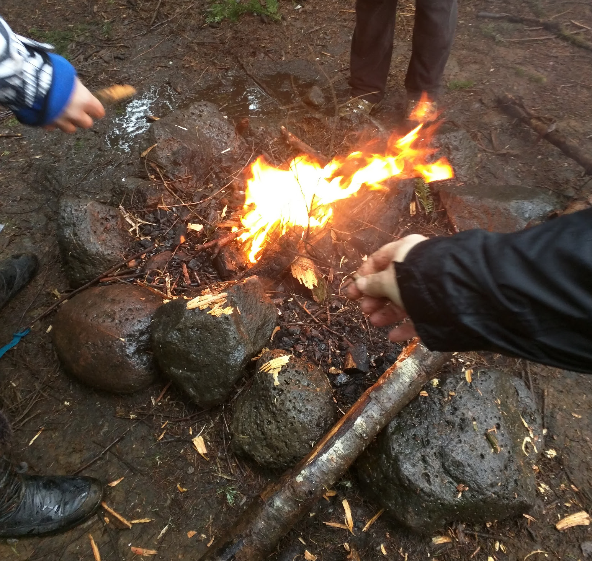

So I've been pretty busy since I posted my [Crafting Manifesto](http://www.samjulien.com/crafting/) a couple of weeks ago. I made a few more lights blink on my Arduino, this time in relation to temperature changes. The Makey Makey kit arrived and I started tinkering with it and seeing how I can make music with it. I took the safety orientation at ADX and got to use a chop saw and a table saw. Oh, and I started blacksmithing, and man, it is insanely difficult (and really fun).

I spent today wandering around a wet, cold forest in the rain with a bunch of strangers learning basic survival skills and how to build a fire. **It. Was. Awesome.** There's something about walking around with a knife looking for ways to start a fire in the rain that is really satisfying on a primal level.

When I woke up this morning, my first thought was, "What possessed me to sign up for a Wilderness Survival class in the middle of January?" When I arrived, though, the instructor pointed out something I hadn't thought about: this is actually the best possible time to learn survival skills, because there's a pretty good chance you won't get stuck in worse conditions (he may have also used the word *schadenfreude* to describe why he liked teaching on these days, but I chose to ignore that). So, we played on hard mode today; we made fires out in the rain, first on the ground, then in an existing (though empty) fire pit:

I learned a ton. In fact, I'm going to write some stuff down here so I'll remember it:

* Tin foil is exceptionally well-suited to be a vapor barrier when building a fire. Plastic also works.
* Staying put, staying warm, and staying dry are your biggest priorities when lost for the first 72 hours. Injuries and exposure to the elements (e.g. hypothermia) are your main dangers. After those would be dehydration, though in Oregon and Washington that shouldn't pose too much of a threat.
* Dryer lint or cotton balls and vaseline make some awesome tinder.
* Rain boots and rain pants. Seriously. Jeans and hiking shoes are completely awful when you're in the rain.
* Wool socks are basically the greatest invention of all time.
* Hemlock tree branches make very good initial kindling because they are wispy and brittle.
* Alder tree bark is easily shaved and split for more kindling.
* Cedar. Is. The. Bomb. You don't always need sap wood, but if you find it, you're golden.
* Speaking of sap, tree sap is a good starter.
* Bark and pine cones are meant to be fireproof. Don't think they're going to burn.
* The gloves I brought, while great for cold days downtown, are horrible in the rain. I need better gloves.
* Even for really simple hikes, you should always bring a whistle, a flashlight, and an emergency fire starter kit (in addition to water of course). And probably a first aid kit. 
* The biggest challenge to starting a fire is preparation. You need to get all the different sized pieces ready to go before starting so that you can add them at the right times to keep the flame growing. You work your way from the fineness of hair, to the lead of a pencil, to the body of a pencil, to the size of your finger, always being sure to allow the fire to breathe.
* Keeping your belongings and potential fire supplies dry is really important, so put things in bags and let kindling dry in between layers of your coats. Only take things out when you need them.
* I want to take a wilderness first aid class and a class on wild edible plants.

The other benefit to taking this class in January is that I've got plenty of time to get my supplies in order before spring and summer roll around. I'm stoked (and I'm not even sorry for that dad joke).

That's all for now. This post is dedicated to my friend [Joyce](http://www.joycepratt.com/), the most inspiring survivor of them all. You fought and fought and fought until the bitter end, and always with a smile. 

