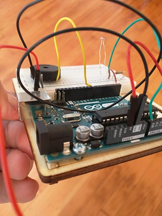

It's been a while since my last update, but it certainly hasn't been for lack of stuff to talk about. In addition to seeing both Talib Kweli and Godspeed You! Black Emperor in the same weekend and taking a quick trip to LA, I made some good progress in the rest of January and February on all of my making and crafting endeavors.

To start with, I finished up the blacksmithing basics course I was taking (check out the sweet barbecue turner and bottle opener I made above). I also made a candle holder (well, two, given I messed up the first one pretty badly). More important than the silly little introductory projects, though, was learning the basics of smithing and shaping metal. There's a lot of physics involved, which is really fascinating, particularly how the angle and movement of the metal, as well as the position on the anvil, impact (literally) the result. I'm definitely going to keep learning and practicing. It's incredibly cathartic to hammer hot steel at the end of a day, and I've noticed it's improving my ability to concentrate in other areas. Something about only having a minute or two at most at a time to hammer with power and accuracy translates to things like weightlifting and work.

I also took an intro to woodworking seminar, which was essentially a four hour lesson in making wood perfectly square. It was also a way to get more comfortable with the jointer, planer, table saw, and chop saw and learn some basic glue-up techniques. I'd never taken any woodworking classes before, though, so I really enjoyed it and learned a ton. Working with wood is really satisfying; it's a beautiful medium. Another thing I'll keep pursuing. I met someone from [Northwest Woodworking Studio](http://www.northwestwoodworking.com/) the other night, so maybe I'll do something with them someday. In the meantime, ADX has some additional classes, and I'll just start tinkering with wood from some local places I've learned about like [The ReBuilding Center](http://www.rebuildingcenter.org/).

Speaking of tinkering, I've made a couple more circuits with my Arduino, like this little light-sensing theramin:

The Arduino reads the light sensor information and changes the pitch coming from the little piezo speaker accordingly. I also made a color-changing LED and a super primitive musical keyboard using the same principles. I've found some like-minded folks in town, too, so I've been able to get a lot of help and inspiration. I was able to attend a Hardware 101 seminar, which was really informative, and I've got a couple different Raspberry Pis and an Adafruit Feather Huzzah kit (via the new [Structure](https://www.getstructure.io) IoT platform) on the way to continue my experimenting. So, more to come. As an analog synth geek I'm excited about the musical applications of this stuff, but I'm also really intrigued about the industrial and humanitarian uses for IoT.   

This is getting lengthy, so I'll stop there for now. Still on the docket over the next few months: knife-making, table saw basics, and a wild edible plants class. Stay tuned. And hopefully as I continue to write I'll start to synthesize some of this stuff, which is kind of the goal of writing it all down in addition to just documenting my progress.

I've been geeking out over Kate Bush lately, so I'll leave you with the video for [Cloudbusting](https://www.youtube.com/watch?v=pllRW9wETzw), which was directed by Julian Doyle and features Donald Sutherland as Wilhelm Reich. 

Cheers!
