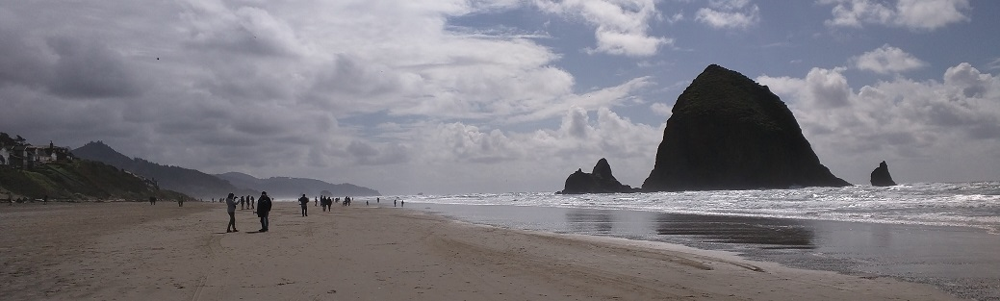
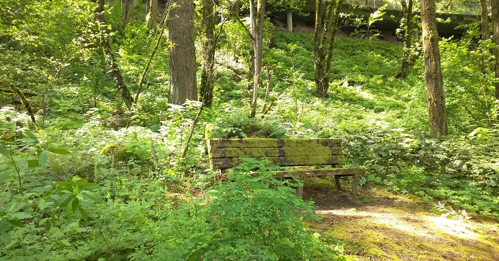
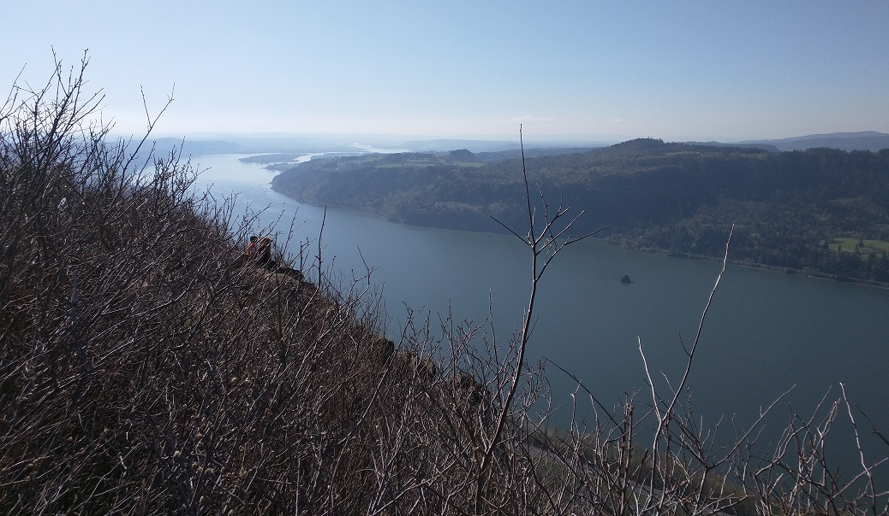

March brought with it a sort of turning point. A shift in perspective. 

I've had a fun and busy few months since I went all-in on my plan to turn my life into an adventure of crafting instead of consuming, but March was a whirlwind. After traveling for a week, I returned home to a visit from some good friends from New York and Seattle. The next day, I took a wild edible plants class (more on that later). Not long after that was a table saw class, a couple of band practices, and salsa dancing for the first time. I was sick for a few days after that marathon, but then was back up and running with IoT work and the unexpected discovery a new best friend.

That's about when I crashed. I was heading back from an errand in the suburbs one Sunday and as I approached the on-ramp to highway 26 I just couldn't resist the call of those words underneath the sign to head west: "OREGON COAST."  I decided I needed to hit Cannon Beach to get some time to reflect and talk to my sister on the phone.

The breathtaking beauty of Cannon Beach never fails to return my perspective to normal.

It hit me when I was driving to the beach that day that spring had sprung, and now is the time to be outside every weekend (and as much as possible in between). It's hard to synthesize what all has happened in the last six weeks or so, but it feels like it's been a time of emerging into spring after a long winter of focus on improvement. It's been a time of recognizing what I've got in me. Wandering around forests and waterfalls and climbing up rocks to reach a peak and gaze out at that magnificent Gorge. Sometimes the forest glows so green that you can hardly believe what you're looking at isn't a dream. 

It's been a time of learning to woodwork while carving out with greater precision the areas of tech, hardware, and social justice I want to focus on. And synth classes and homemade brunch with good friends. Walking along a tree-lined path around a lake and sitting to meditate with a group of strangers on the rocks. Band practices and preparing tech talks and dancing. Watching Joanna Newsom in awe. Cooking. Foraging and learning to eat yellow dock and sheep sorrel and salmon berry flowers and ox-eye daisies. Noticing for the first time just how many different kinds of plants are beneath my feet at any given time out here.

I think a lot these days about consumption and contentment. I think about how consumption shouldn't be a path to happiness, how too much consumption inhibits creativity and crafting. I've been de-cluttering a lot lately, both physically and mentally. I've been reducing the amount of entertainment and mindless consumption I have in my life. It's been refocusing me and making breathing room for this growing desire to create. Consumption and creativity seem to be two fire hoses aimed at each other, and to let one pass you have to turn down the other.

I've also lost about 25 pounds since December. And I turned 30 with some of my best friends around me.

I think my 30's will be spring for me. I hope that I can use it wisely and to help other people. I hope I can somehow further justice in it. I hope I can use it to enable others to be free in their pursuit of knowledge and happiness to the degree I have been. Because otherwise what has it been for?

