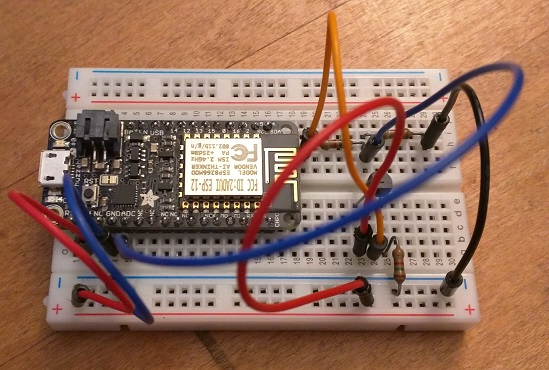

Want to get into IoT development but not sure how? Got a shiny new [Adafruit Feather HUZZAH](https://www.adafruit.com/products/2821) with the amazing ESP8266 chip? Want to control it with JavaScript? Well, thanks to the fine folks on the Firmata team, now you can.

I got my Feather HUZZAH from the kind people at [Losant](https://www.losant.com/) in one of their builder kits and got inspired to try to re-purpose their [temperature sensor circuit](https://docs.losant.com/getting-started/losant-iot-dev-kits/builder-kit/#workshop-3-temperature-sensor) with the stack I've been working on that I've affectionately named [IoTReX](http://samjulien.com/iotrex): socket.io and johnny-five piping analog sensor data to RxJS.

What follows is a walk-through of how you can do the same!

## Background

The ESP8266 chip stands to force some big changes in the IoT world. It's really tiny, it can support WiFi out of the box, and it's dirt cheap - the chip itself is about $2, and development boards that include the chip like the Feather, the [Pattern Agents TSOC](http://patternagents.com/projects/TSOC-ESP8266.html) (created here in Portland!), or the [SparkFun Thing](https://www.sparkfun.com/products/13711) run for less than $20.

_Side note: if you've got one of these other boards, try to follow this tutorial despite it being geared toward the Adafruit incarnation. Just select the right board configuration when you get to the end of the ESP8266 core setup below. I'd be curious to hear whether this process works with other ESP8266 boards!_

There are two different ways that you can use JavaScript with the ESP8266 boards:

- Embedded, which means that you're running a JavaScript interpreter like [Espruino](http://www.espruino.com/) on the board itself. Native JavaScript on a microcontroller - how exciting!
- As the client of a host-client relationship.

This walkthrough is focused on the latter. Running native JS on the Feather is indeed possible, and thanks to [Craig Dennis](https://twitter.com/craigsdennis) and [Andrew Chalkley](https://twitter.com/chalkers), there's now even a spiffy one-click GUI called [Flasher.js](https://github.com/thingssdk/flasher.js) that can help you get going.

What intrigues me about johnny-five, though, is the doorway that it opens into the entire Node ecosystem. Theoretically, you could pipe your Feather data into _anything_ that runs on Node, even React or Angular. I myself am pretty nerded out these days on bringing functional reactive programming to hardware by using things like RxJS and Redux to handle data.

So let's get started.

## The Big Picture

IoT is a different set of abstractions than you might be used to when just writing code (it's been an adjustment for me for sure). From bottom to top, the stack looks like this:

- Feather HUZZAH (voltage and circuits)
- ESP8266 Core
- Firmata library (specifically StandardFirmataWifi, the implementation we'll be using)
- Node.js with johnny-five, a library that uses Firmata to communicate with the board
- The rest of the Node stack of your choice, e.g. Hapi (or Express) and the front end framework _de jour_

### Step 0: The Circuit

As I mentioned above, I used the [temperature sensor circuit](https://docs.losant.com/getting-started/losant-iot-dev-kits/builder-kit/#workshop-3-temperature-sensor) from the Losant builder kit. You can connect any analog sensor you you wish to the ADC pin, just keep in mind that you may have a need for voltage division. The Feather ADC has a max voltage of 1V, but many sensors are meant for more than that. SparkFun has a [helpful introduction to voltage division](https://learn.sparkfun.com/tutorials/voltage-dividers). Incidentally, if you're using the NodeMCU board that Losant includes in its other kits, that board has the voltage division built in for you already.

If you decided to build the Losant circuit with the TMP36 temperature sensor from the instructions at that link, the finished circuit should look like this:



### Step 0.5: The Arduino IDE

Because I don't want to make any assumptions (and definitely _not_ because I made this mistake myself), I need to make one quick point about the Arduino IDE. It turns out Arduino has had some identity issues from various disagreements that are too complicated for me to get into right now. Because of this, there are actually two Arduinos out there: Arduino.org and Arduino.cc. Here's a [Stack Overflow post](https://arduino.stackexchange.com/questions/11824/difference-between-arduino-cc-and-arduino-org) that explains it the situation. All you need to know right now is that you need to make sure you have the **[Arduino.cc IDE](https://www.arduino.cc/en/Main/Software)**, not the Arduino.org one, because it has options for using additional boards that the latter does not.

Pro tip: enable line numbers in File > Preferences!

### Step 1: ESP8266 Core

Now that we have the right version of the IDE, we need to make sure we have the most up to date version of what's called the ESP8266 core library. Think of the core as the API for the Arduino platform. It provides a layer of libraries the ESP8266 can use to communicate with the Arduino IDE and run Arduino sketches. What comes pre-flashed on the ESP8266 is a Lua interpreter. The stock firmware is waiting for you to send Lua scripts to execute, but when we use the Arduino core, we're replacing this firmware with our own to give us access to all the good things that come with the Arduino ecosystem, including eventually being able to use JavaScript to control the Feather remotely.

To download the core libraries, follow the most current instructions at the [ESP8266 Core repo](https://github.com/esp8266/Arduino). It basically amounts to:

- Start the Arduino IDE and open the Preferences window.
- Enter `http://arduino.esp8266.com/stable/package_esp8266com_index.json` into the Additional Board Manager URLs field (if you don't see this, you've got the wrong IDE).
- Open Boards Manager from Tools > Board menu, search for "esp8266", and install the latest esp8266 platform. At the time of this writing, 2.2.0 was required for Firmata.
- From Tools > Board, select the Adafruit Huzzah.


### Step 2: Firmata

Congratulations on getting the ESP8266 core installed! Now we need to get the Firmata firmware running. Firmata is a MIDI-like protocol used to communicate with Arduino-compatible boards. It makes interacting with circuits really easy!

As of right now, ESP8266 support is in the master branch of the Firmata code, but not in the release available in the Library Manager of the Arduino IDE. You can check the instructions at the [Firmata repo](https://github.com/firmata/arduino/), but the first thing to do is open up a terminal and run `$ git clone git@github.com:firmata/arduino.git ~/Documents/Arduino/libraries/Firmata`.

On Windows, this is the Documents folder in your user folder.


Once the code has been cloned:

1. Restart the Arduino IDE.
2. Open up StandardFirmataWifi from File > Examples > Firmata. This opens StandardFirmataWifi.ino as well as wifiConfig.h.
3. On line 85 of StandardFirmataWifi, uncomment `define SERIAL_DEBUG`. You'll need it to read the IP address of the board.
4. Click the tab for wifiConfig.h. You should be able to leave most of parts of Step 1 and 2 as-is for the Feather. In Step 3, put in your wireless network name on line 119 for `char ssid[]`.
5. Step 4 lets you configure a static IP. I'm using DHCP so we'll skip that for now. You can also leave the default port in Step 5.
6. Comment/un-comment the right WiFi security options you need in Step 6. Option A (default) is WPA, B is WEP, and C is open network.
7. Do yourself a favor and do a "Save as" of StandardFirmataWiFi with your settings.
8. Plug in your Feather and be sure you've selected the Huzzah board in Tools > Board as directed in Step 1. Check that your port matches.
9. Upload StandardFirmataWiFi to the board!
10. Assuming it compiles and loads correctly, smile with satisfaction. Maybe eat a cookie.

Next, open the Serial Monitor with the button in the top right corner of the sketch or from the Tools menu. Set the baud to 9600. Other communication with the Feather happens at 115200, but for some reason the debug information from Firmata happens at 9600. With the serial monitor open, press the little reset button on the board. You should see logging in the serial monitor, including the WiFi connection information and assigned IP address. Copy that IP address down, we'll need it for setting up johnny-five.

Onward!

### Step 3: J5 and Beyond

Phew! Congratulations on making this far. You've finally made it to the really fun stuff: using JavaScript to control and read from the Feather using Node and johnny-five.

Clone my IoTReX [starter-feather](https://github.com/IoTReX/starter-feather) repo and run `npm install`. Make sure you have gulp installed globally for the build process to work. This repo has johnny-five is plugged into a stack that sets up a Hapi server decorated with socket.io. You can then use that back end with any client code you wish.

For future reference, if you're creating a new project or using an existing one, you need to make sure to include both johnny-five and etherport-client in your package.json file. The latter is used to communicate wirelessly with the Feather.

In the repo, the file `server/device.js` is where the johnny-five magic happens. If you don't want to use johnny-five as part of a web app, you could also borrow this code for a stand-alone Node app. Just remove the references to socket.io.

The first piece of this file is the boilerplate for setting up the board:

```javascript
var EtherPortClient = require('etherport-client').EtherPortClient
var Firmata = require('firmata')
var five = require('johnny-five')

var board = new five.Board({
  io: new Firmata(
    new EtherPortClient({
      host: '192.168.0.110',
      port: 3030,
    }),
  ),
  timeout: 1e5,
})

var tempSensor
```

Be sure to change the IP address to what you wrote down earlier. We actually connect to the board and start getting the data from our sensor within the getDecorateIO() function:

```javascript
board.on('ready', function() {
  console.log('ready')

  tempSensor = new five.Thermometer({
    controller: 'TMP36',
    pin: 'A0',
    aref: 1,
  })

  io.on('connection', function(socket) {
    console.log('sockets on connection')

    tempSensor.on('change', function() {
      console.log(this.C) //Celsius
      console.log(this.F) //Fahrenheit
      socket.emit('tempData', this.F)
    })
  })
})
```

One important thing to note is that we need to pass that `aref: 1` option to the thermometer module. Remember that voltage division we had to do? AREF (analog reference) tells johnny-five the max reading available (1V).

At this point, you could also customize the client side code to your liking, but you don't need to if you've followed along up to now.

Now, be sure your Feather is powered up, either plugged in to your computer or connected to a USB charger. If it's plugged in to your computer, check that you have the Arduino IDE closed so it doesn't tie up the port with the serial monitor.

Run `npm start` to build the front end with gulp and start the server. It takes johnny-five a few seconds to connect to the board at the moment, so be patient. After a few seconds, you should see "READY!". Open up `http://localhost:8080` and bask in the glow of Marbelous visualizing an RxJS observable of your temperature readings! You should be seeing Fahrenheit readings that roughly correlate to the temperature of the room. If something is wildly inaccurate, check your circuit.

### Step 4: Celebrate - then make it better!

You should feel pretty accomplished at this point! You have successfully flashed the Feather with the ESP8266 core and Firmata and can now use johnny-five to read from and write to the board. On the one hand, wow, that took a lot of work just to get some temperature data. On the other hand, the JS world is now your oyster. Read through the [johnny-five docs](http://johnny-five.io/api/), build some circuits (you can refer to [this Adafruit guide](https://learn.adafruit.com/adafruit-feather-huzzah-esp8266/overview) to get a better understanding of the hardware), and plug J5 into virtually any Node environment you wish. Why not make a React app that uses light sensor readings to control an interactive UI? You could even have buttons that control lights connected to the other pins of the Feather! My original [starter-platform readme](https://github.com/IoTReX/starter-platform/blob/master/README.md) has some ideas on how to extend what you've done so far.

Be aware that this stuff is still pretty bleeding edge, so you may find that circuits or libraries aren't working smoothly out of the box. Don't be afraid to bring things up and ask questions on GitHub or Twitter - there's a good chance someone else is having the same problem you are.

Most importantly, have fun!

## Gratitude

These instructions are primarily based on [this instructable](http://www.instructables.com/id/ESP8266-Firmata-J5-NodeBot/) by [Rahul Thakoor](https://github.com/rahul-thakoor) and [this thread](https://github.com/firmata/arduino/issues/257) of communication with the great folks at the Firmata team (like [Jeff Hoefs](https://twitter.com/soundanalogous)) working on their implementation of the ESP8266. It's also based on conversations with insanely patient people like Andrew Chalkley, Craig Dennis, [Brandon Cannaday](https://twitter.com/TheReddest) at Losant, and [Rick Waldron](https://twitter.com/rwaldron), the creator of johnny-five. [Josh Tompkins](https://twitter.com/jtompkinsx) helped me edit this post. I'm very grateful for all of these people!
