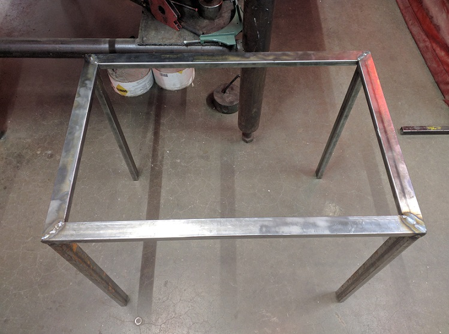

Wow, somehow it is already mid-September. The summer completely flew by, but it was full of adventures. The above is a picture I took while backpacking and camping on Mount Hood.

I started this year with the goal of shifting my focus and actions from consuming to making. So far, that thread has pulled me along through many corridors. It's made me contemplate a more minimal life, it's pushed me to do things I've never done, and it's been the source of a lot of life lessons already. 

Here are some skills I've started learning since January:

- Basic blacksmithing and knife-making
- Woodworking
- MIG welding and metalworking
- IoT and electronics
- 3D Printing basics
- Bushcraft and wilderness survival, which encompasses a wide range of things like fire-starting and knot-tying and using a compass

I'm still a novice at all of these things and haven't yet produced much. My humble creations thus far include a small wooden box, a knife (that I still need to sharpen to be useful), a photoresistor theremin and smattering of other IoT prototypes, and some less than stellar blacksmithing trinkets like a barbecue turner that looks more like a medieval torture device. Right now, though, I'm working on my first real project, which is a coffee table and end table set with frames of steel and tops made from scrap wood. I'm doing this at ADX over a couple of different classes and in my free time. 

Embarking on a big project has been teaching me a lot, both on a practical level and on a philosophical level. Novelty carries with it a level of excitement and passion. Starting to learn a new skill, starting a new job, moving to a new place - there's always a level of inspiration that comes with beginning something new. I've been doing a ton of that over the last few of years. Three or four years ago I was in a completely different place by almost any meaningful measure, and I have deliberately made massive changes in my life to improve it. But the novelty of those changes is starting to wear off, and that's where I'm learning from working with wood and metal.

Once the excitement of novelty wears off, the focused work begins. It's less glamorous and it's difficult, but that's where real progress is made. It becomes a grind -- a literal grind in the case of metalwork. With these tables, only a couple of parts of the process are exciting and provide instant gratification. The initial design process is pretty fun, laying out the wood pieces and figuring out how it's going to look. The final plane of the glued up wood top is very satisfying. Welding is a rush, except that it's difficult when you're a newbie. It takes a lot of practice to get the right flow, the right settings, the right technique, and I still have a long way to go. But there's a good deal of this process that is just, well, work. I think with intellectual or emotional tasks we can trick ourselves into believing this work doesn't need to happen. In the physical world, that's just not possible. You have to cut, clean, and grind your metal before you weld it. You have to plane and join your wood to get it perfectly squared. You have to tediously clamp your wood and then glue it up in a well executed, planned out process.

But it's the cleaning and grinding that allows you to get strong, solid welds and prevents rusting. It's the planing and joining that give you good seams to glue. It's the gluing that gives you something to sand, plane, and stain so it looks nice and remains durable. The mundane, repetitive work is literally where the project takes shape and comes together, and it's really enjoyable to watch the character of the table top reveal itself as you methodically shave off a fraction of an inch at a time to make it flat. And, because we're imperfect creatures, the way it turns out isn't always exactly what we plan, but those imperfections cause a complexity to emerge that we simply cannot design in advance. The aberrations from perfection give the piece character and truly make it your own work. I see a lot of beauty in that.

There's probably more to say about that, a lot more philosophizing -- but I should probably wait until the tables are actually finished. I still have a lot of grinding, sanding, painting, and staining to do.

