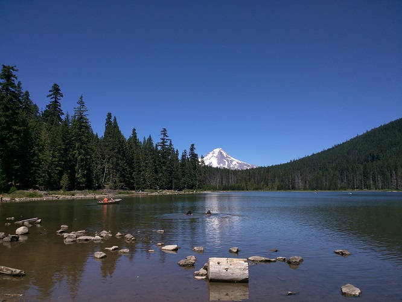
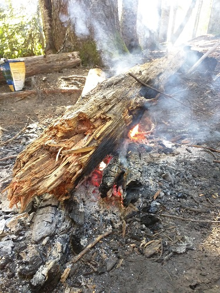
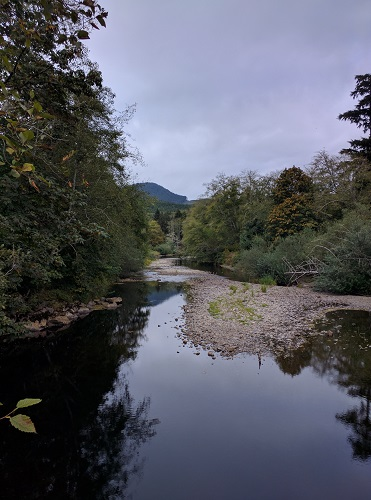
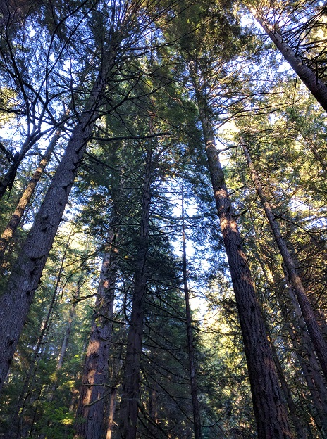

***Or: what to do in places where people can go outside without dying of heat exhaustion.***

Okay, so you want to get started with hiking or camping or something else outside of the four walls in which you eat and sleep and watch Game of Thrones (or Daniel Tiger, depending on your status in life). You start googling, you pull up some web sites, you get inundated with a barrage of information and products and tutorials. You promptly close your computer, turn on the TV, and fall asleep. It's too overwhelming. You need a place to start. 

When I moved to Oregon, I had only been camping once or twice in my entire life, and I had only done a smattering of small hikes. I'd wanted to get into outdoorsy stuff for as long as I can remember, but I grew up in the hot, humid south. Good for biscuits and gravy, bad for camping. Fast forward to 2007, I am hiking for the first time in the Pacific Northwest with my ex to Comet Falls on Mount Rainier wearing a North Face fleece. I look down and see the trees, I stand in front of a waterfall (I can still feel the cold air). Something clicks inside of my head. This is what I need in my life, this is where I'm meant to be.

It took me another seven years to get back to the PNW, but here I am, exploring the Columbia River Gorge, the Oregon Coast, and Mount Hood like the vast wonderland that it is. It's funny, I remember being so completely dazzled by Mount Rainier. I remember thinking how uniquely beautiful Comet Falls was, despite being blown way by the thought that that was one waterfall on one trail on one mountain in one part of the world. I remember worrying I wouldn't be able to ever see something so breathtaking ever again.  Now it's all around me. "Commonplace" isn't the right word to use by any means, but -- accessible. Mount Rainier and Comet Falls are still gorgeous, but now I get to see a whole treasure trove of beauty all the time.

At any rate, since moving here I've been trying to learn as much as possible about camping, backpacking, hiking, wilderness survival, and even a bit of bushcraft. In addition to my own trips, I've been taking classes, talking to friends, and researching online.  One thing I keep running into is the fact that most people I talk to out here in the outdoor world have been around this stuff most of their lives. They've grown up in California, Oregon, Washington, Utah, or Montana and have been hiking since they were kids. Their parents "dragged them" to the forest for family trips and brands like Columbia have been household names for them for as long as they can remember. 

That's not me. Not at all. So I thought I'd start writing down everything I've been learning and compiling the resources that have been helpful for me. That way, if other Southerners one day find themselves in the Great Outdoors, at the very least you won't die if you've read my blog (though I take no responsibility for your own stupidity), and at best you'll have a great time. I'm still a novice for sure, but I'm tapping a lot of resources out here from different sources.

The primary goal of this first post is to start equipping you with a **system for planning** outdoor adventures. A particular piece of gear or a random bushcraft tip is not going to be helpful in isolation, and a list of products to buy is the last thing you need. I'll share stuff like that over time, and I'll share what gear I'm currently using, but that's all secondary to learning about the different thought processes you need to develop. 

In subsequent posts, I'll cover the different areas like food and water, clothes, and navigation. I also just started a 9-month wilderness immersion program through Tracker's, and I'll be blogging about that too. Those posts will go into some detail because I'll be writing down things I learned for the sake of committing them to memory.

Okay, enough origin story, let's get this started. Developing a system for wilderness adventures takes three steps: 

1. What do you want to do?
2. Where do you want to go?
3. What should you bring with you?
  
# Step 1: What Do You Want to Do? (or: A Dumb Thing I Didn't Know)

So here's something I didn't understand when I first moved out here. There are different varieties of hiking/camping/wilderness activities, and thus they have different lingo, different gear, and different (though overlapping) skills required. I kind of thought that hiking was hiking, I didn't know there was a large variety of types of hiking and camping. That sounds really obvious to me in hindsight, but it really wasn't at first. Let's go over some common examples.

- **Day hiking** is just going for a jaunt somewhere. You might bring a backpack with some basics, but you're not planning on sleeping outside.
- **Car camping** is where you just bring all your stuff and camp next to your car. You don't need to worry about weight or being practical. In my experience, this is what the average person thinks of as camping.
- Then there's **backpacking**, which is where you're packing all your gear with you, hiking somewhere, and camping. You might camp on your way to a destination, on the way back, or at the place itself, but the point is that you're carrying everything. You'll see the term **ultralight** in this arena because people count ounces like calories. Backpacking is what most appeals to me so far and what I'm trying to get experience in.
- A side venture from this is **climbing**, which can also morph into **mountaineering**. These are the folks who want to scale rocks and summit mountain-tops, and their gear involves lots of rope and hooks and stuff. I haven't gotten this far yet, but I'd love to get into it someday.
- Finally, **bushcraft** is a different side venture, and that involves living off of and surviving from the land itself. It involves making tools, foraging, hunting, and building shelters. TV makes this look like Man vs. Nature, or conquering nature, but the real bushcraft experts are about living with nature and not wasting resources. We'll get more into this later. It's also a hilariously precarious short walk from bushcraft to the survivalist bomb-shelter crowd, so fair warning that when you start getting into this your YouTube suggestions are going to start looking like you're expecting the Apocalypse.

So the first step in getting started with this stuff is: **figure out what you want to do**. Are you just interested in getting a way for a night and cooking outside? Sounds like car camping. Do you want to get exercise and spend time outside on the weekends? You're a dayhiker. Do you want to venture out and camp in remote places? Do you dream of hiking the Pacific Crest Trail (I do)? Spend time learning about backpacking, my friend. 

# Step 2: Where (exactly) do you want to go? (Planning your route)

Just as deciding what you want to do impacts what equipment you need and what skills you need to learn, so does your destination. Here are a few things to consider when planning a trip:

- How long do you want to be gone - a day, two days, a week?
- What kind of habitat do you want, and what's the weather like? (You might not get much choice here depending on how far you want to travel.)
- What's your fitness level like? Hikes are generally rated by distance and elevation gain, which affects the steepness of the path.

Depending on where you live and what's nearby, this might be determined quickly. If you've got one or two parks you can hike in, or one set of mountains within driving distance, that's that. In the PNW, the amount of choice is dizzying. Coastal hikes, high desert, week long trips - it's all possible. Between the Coast, the Cascades and the Gorge alone, there are thousands of possible hikes. For me, the most successful thing has been to just pick something and do it. This could be because friends are going, or because someone told me about a trail they loved, or because I saw it on a web site or in a book. 

If you're car camping, you'll obviously be limited by those areas that allow vehicles or short hikes that are close to parking lots. If you're backpacking, to include climbing and mountaineering, you've got many more options.

As an example, let's say you have some nearby forest area, and you want to be gone for a weekend. Most people can hike 1-2 miles per hour depending on how much gear you've got on and how steep the climb is. The length of the hike you want should be determined by what your goal is. Are you mostly interested in the hiking, such as getting to a particular view, or are you interested in hanging out by a fire? You might decide to do a three mile hike, which will take a couple of hours, and have a leisurely camp.

Once you've got the length and general area in mind, start perusing web sites, talking to friends, and finding books related to that general area to find a particular trail. Of course, if you're just day hiking, you can potentially just show up and explore. But if you've got gear for camping, or you're hitting some deep back country, you'll have to do some research, and you may need to reserve a spot or get a permit ahead of time. You can get Fodor's travel guides and other books on Amazon  for trail and campground information, and these days there are tons of detailed web sites with the same. The government web sites for national and state parks are excellent. Be sure to pay attention to any weird directions those guides point out or anything distinctive about where you're going. Most of these old parks have old signage and you might not have cell signal. Print out a map of some kind and bring it with you (we'll talk about navigation in another post).

# Step 3: What do you need to bring with you? *(The Ten Essentials, The Five C's, and How Not to Die)*

You've figured out what you want to do and where you want to go, so you have some direction, but now you need the right equipment. You pull your laptop back out and start googling "camping gear." Seven million product recommendations and gadgets and videos pop up. Back to Netflix it is.

This brings us to the next step in this process: **determining what to bring with you**. What you want to do, as well as how primitive you want to be, will determine what gear you'll need.  There's a sliding scale of skill and gear that's related to convenience and weight. Here's the good news: ***after safety, this all comes down to personal preference - what's important to you.*** Aside from not dying and not trashing nature, there's no perfect way to hike or camp. For me, sleep is paramount, and I'm a picky sleeper, so I'm willing to trade some ounces and make sacrifices on food for the sake of having a good pad and sleeping bag. I'm also willing to be less hardcore about being primitive with sleep. Give me some wood to carve and some wild plants to eat, sure, but I'm not going to sleep on a pile of leaves under a tarp or up against a tree unless I absolutely have to. 

For you, hot food might be critical for your sanity. You might be willing to be cheap with your sleeping bag in order to buy a stove. You might dispense with some other comforts for the sake of being able to cook. 

So where do you begin to figure this out and see what your options are? Well, luckily, a lot of smart people have come up with "systems" or areas of focus.

For example, bushcraft folks (like in the book [Bushcraft 101](https://www.amazon.com/Bushcraft-101-Field-Wilderness-Survival/dp/1440579776/ref=sr_1_1?ie=UTF8&qid=1475264733&sr=8-1&keywords=bushcraft+101)) talk about the "five C's" of essentials:  

1. Cutting tools (to make stuff)
2. Cover elements (protection from weather/bugs/animals)
3. Combustion devices (fire for warmth, cooking, and many other things)
4. Containers (for water and collected food)
5. Cordages (rope and para-cord)

REI and some other outdoor companies talk about the [10 Essentials](https://www.rei.com/learn/expert-advice/ten-essentials.html). This started as ten pieces of equipment but has evolved to ten systems, or areas you'll need to cover:

1. Navigation (map and compass)
2. Sun protection (sunglasses and sunscreen)
3. Insulation (starting with clothing)
4. Illumination (headlamp/flashlight)
5. First-aid supplies
6. Fire (waterproof matches/lighter/candles)
7. Repair kit and tools (translation: duct tape)
8. Nutrition (this includes fuel if you're cooking with a stove)
9. Hydration (including water filtration)
10. Shelter (including emergency shelter)

This can seem really overwhelming at first, as if you need to run out and drop thousands of dollars just to go be in nature. Some people do this, but it's not only unnecessary, it's not smart. You don't yet know what's important to you, what comforts you'll need, and how you handle different situations. Let me recommend a better approach.

**First, the main priority is to get what you need to be safe and stay alive.**

Safety is first determined by your environment. What things in your destination can hurt you or cause you discomfort? Is it heat, cold, rain, bugs? In the PNW, it's being cold and wet from rain, so the primary danger is hypothermia. You quickly learn how important wool socks and fire are here. On the flip side, water is abundant, so you usually are good to carry very little water along with a filtration system. Is where you're going abundant with water? If not, you might need to carry more water with you, which will weigh more. Note that not all water sources are available year round, and your map will have a separate symbol for seasonal water.

No matter where you live or what your plan is, go buy an inexpensive first aid kit and a whistle. Do it. Open Amazon in a new tab and put in your order, then come back and read the rest. I'll be here.

Those two items are critical because, even day hiking, stuff comes up. The main reason people die in the wilderness is because they get lost, they panic, and that causes them to wander around and make a mistake that leads to a broken leg. In general when in the wilderness, your three biggest priorities are to **stay warm, stay dry, and stay hydrated**. If you're lost, add **stay put** to that. It's much easier to get lost than you think; a whistle will long outlast your voice. It's also much easier to cut yourself or encounter a poisonous plant or insect than you think; a first aid kit will be worth every penny in a situation like that. Another underrated benefit of a first aid kit is moleskin or bandages for blisters. Nothing ruins a hike like a blister, and just having a solution on you for that can make a break a trip.

I've always been a preparer; people have teased me for it my entire life. With this wilderness stuff, though, I'm finding more and more that my personality fits like a glove. Obviously short day hikes don't require a bunch of prep, but I'm learning that the cooler the thing is you want to do, the more preparation it will take. The most experienced people I talk to out here are also the most prepared. That preparation might be with first aid skill they've learned, it might be with equipment or clothing, it might be with route mapping and navigation. As humans who live in cities, we're used to being in control of our domain. We're used to having predictable environments to a large extent. Nature isn't like that. Weather and wild life don't obey your whims. A mountain doesn't know who you are, and a river doesn't care who your friends are. That's what's so great about it, but it should inspire some respect. Can you get away with being unprepared? Often, yes, if you're lucky. People do it all the time. But don't take dumb risks and then make Search and Rescue come get you.

**The next priority is to get what's important for your well-being and happiness.**

A friend once gave me a great piece of advice on this subject: think of the one thing you need to bring that would make you feel happy and human. For him, it's coffee. He brings an espresso pot on every trip with Italian espresso. He is an ultralight genius who will bring a stove made out of a cat food tin but you'll never find him without coffee. For me, oddly enough, it's a toothbrush and toothpaste. I can be filthy but if I have clean teeth I can sleep at night. I'd rank face wipes as a close second. After you get the stuff to keep you alive, get the stuff to keep you happy. This is about having fun, right? It's not being miserable outside.

**Borrow or get super cheap versions of things until you have more experience.**

This is an iterative process that you'll refine over time. Focus your resources on what's important to you, and allocate the rest accordingly. I knew a good waterproof backpack and a nice sleeping bag were going to be important to me, but I've been borrowing tents from friends for the last year because I wasn't ready to commit. I finally ordered a Mountain Hardware ultralight tent because I've learned that 1) a heavy tent is a pain to carry in a backpack and 2) a cheaply made or confusing tent is incredibly frustrating to deal with when setting up and sleeping in when wet. This would be less important in a warmer, drier area, but camping wet is really no fun. 

When you start looking for gear, there are lots of places to look:

- REI (they have tons of educational resources, too!)
- The Columbia brands (I have seriously never regretted a purchase from them)
- North Face
- Local stores (we've got a store here called Next Adventure)
- Military surplus stores for things like wool and para-cord
- Craigslist and Amazon if you don't have physical stores and to find good deals

Obviously you'll want to read reviews or watch videos on channels like [CleverHiker](https://www.youtube.com/user/daveuofm1/videos) for recommendations, but again, don't stress out. There's a good chance you're going to replace everything you get over time, and you'll learn what you can and cannot skimp on. Be aware, too, that this is a huge industry with lots of money being spent on advertising. Every experienced hiker I've met has said to me, "You need way less than you think you do." And you certainly don't always need the fanciest thing out there. Get the basics and then **just go**.

# Wrapping Up (for now)

Starting to get into the outdoors with zero experience is daunting (believe me, I know). You can't attack it all at once. Hopefully this first post has helped clear up how to start:

1. Figure out what you want to do.
2. Figure out where you want to go.
3. Get what you need to bring with you.

At the end of the day, the goal is to just ***go***. It's okay to make mistakes, it's okay to be wrong, it's okay to feel in over your head. After all, that's what an adventure is, right?

