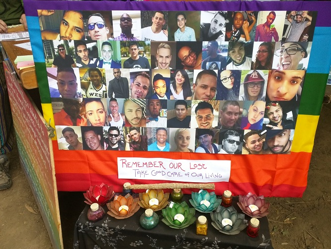
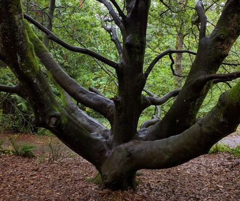

I spend a lot of time and energy running away from who I am - or who I might be if I fully embrace who I am. I'm always trying to measure myself against some arbitrary standard of where I should be in life, and feel the need to segregate different areas of my thought and writing. The more I live through contrasts of joy and pain, though, the more motivated I am to become a more integrated person.

This summer was a blur. I hiked Saddle Mountain, started learning how to weld, gave talks about IoT and functional reactive programming, reconnected with biking and yoga, kayaked a bit on the Columbia, camped at Oregon Country Fair, traveled to New York for a week, backpacked on Mount Hood, and played my first couple of shows in Portland.

But it was also a summer that held a lot of tragedy, on both a national and personal scale. It felt like the capstone to nearly two years now of both losing people I love and witnessing their loss, from siblings to parents to children. It's been this slow burn of sorrow - a cigarette that just won't ever extinguish. So the contrast of those summer months wove this bizarre tapestry of that compounding, devastating sadness mixed in with all of the vibrant, lush celebration of nature and art and beauty that I could drink in.

I think in times of extended tragedy I'm more sensitive to that beauty. In the span of a week, I went from Oregon Country Fair - an event that can really only be described as some combination of Burning Man, Renaissance Fair, music festival, and art show - to the hot, humid streets of Brooklyn and Manhattan. During that trip I went to the Whitney, and I literally stumbled into a tour of the Human Interest portrait collection with the best art museum tour guide ever. His enthusiasm and his depth of knowledge melded into almost a sort of performance that held my undivided attention. When he was explaining a photograph by Helen Levitt titled, "New York (Laughing Baby in Carriage)," he said something I'll never forget: "She had the ability to capture the extemporaneous encounter of wonder." That phrase - "the extemporaneous encounter of wonder" - stuck with me, and so perfectly articulated the surprising joy I was finding amidst so much sadness. At Oregon Country Fair, I was struck by small things of beauty or acts of kindness, like handmade colorful banners or a memorial someone had made for the victims of the Pulse shootings.

Shortly after I returned from that trip to New York, I lost an old friend to cancer and the sister of another old friend to depression. And so again I found myself grieving and confronted by mortality. And so again I went looking for beauty and found it by a lake in the forest, on the side of Mount Hood.

I wrestle a lot with this feeling that I'm not doing enough or the right thing. That I'm not helping enough people, if any. Turning thirty has made me feel like I'm in the final seconds of a shot-clock. To be honest, these feelings annoy and embarrass me, because I realize just how privileged I am to even have them. But while talking to some of my best friends in New York, I realized this is becoming more and more common in our globally connected world. One dear friend of mine astutely pointed out that those of us who graduated college or entered the working world around the 2008 economic collapse got the raw end of being a millennial. We were built up with a lot of expectations of just how special and important we could be, and thus get accused of being entitled or self-involved, yet all of that pretty much fell apart at the very time we were trying to become self-sufficient. Most of my friends (and myself) were totally broke after college, and it took us several years of working random food or retail jobs in our early 20s to make it to a salaried or decent-paying job. Many of us (again, me too) did some sort of commission-based work in between the food job and the salaried job. And I'm not complaining - that work made me a better human in many ways.

But now, here we are, all turning thirty while feeling like we finally just started to have some stability - the stability we all assumed we would have after graduating college or trade school or whatever else. Meanwhile, the world seems to be falling apart in every corner. We have this convergence of our lifelong expectations of being "special," our regret and remorse of feeling ten years behind, our newfound privilege of financial stability coexisting with whatever other privilege or social capital we had or didn't have from birth, and a hot garbage fire of social injustice, countless shooting deaths, and a bizarre election straight out of dystopian science fiction.

And what are we supposed to do about it? Social media has heightened my awareness of daily injustice to a paralyzing degree. Meanwhile, I strive to find fulfillment in how I spend my work time and my leisure time and watch the dance of how they intermingle some times but not others.

Should I go teach in Africa? Should I join the Peace Corps? Should I work with STEM diversity non-profits here in America? Should I just strive to improve my own career and siphon what money I can to causes and non-profits? If so, which causes? How can I maximize my finite time alive and conscious to make the world a better place?

Or is all of that a waste in the grand scheme of things, and the best choice is the pursuit of my own happiness?

We millennials who have a conscious have been hashtag-blessed by this disastrous hybrid of a savior complex with dizzying indecisiveness, and it has the ability to render us ineffective. Much is said about the selfish, narcissistic millennial who is so awash in choice and privilege that he or she lives solely for the pursuit of pleasure and self-interest. It seems very little is said about the millennial who wants to help others, but is so awash in choice and privilege that he or she barely makes a move out of sheer paralysis.

It's too much to tackle, at least in isolation, at least from the outside-in.

Perhaps looking at the global scale is the wrong approach. There seems to be an enduring truth in this universe that complex systems evolve from simple ones. I was reminded of this a couple of weeks ago as I was doing some wood carving. I find any sort of material work very cathartic. Take all the stuff you're worried about and forget about it - just make this piece of wood into a wedge. That's it. That's your only job. Amazingly, after slow, methodical work, that wood starts to evolve. A branch becomes a wedge, which helps split other wood, which becomes a fire. That fire is used to cook food, and soon other people are around that fire sharing a meal and talking. Advice is being given, burdens are being shared, relationships are deepening. There are many ways you could arrive at the fireside conversation, but you can't start with it. It has to be built - consciously and deliberately.

So maybe the important thing is to do the best with what you can. To "lift where you stand" as the piano-moving story goes. Maybe the important thing is to focus on who you _do_ impact, not on who you _might_ impact. We live in interconnection, not isolation. Limit your focus to the world with which you actually interact, not the world you see online where tragedies slip past you just as quickly as they happen. Look out for people where you can, love who you can. And then, over time, gradually but deliberately, widen that circle.

At least that's what I'm going to try to do. I'll keep you posted on how it goes.

