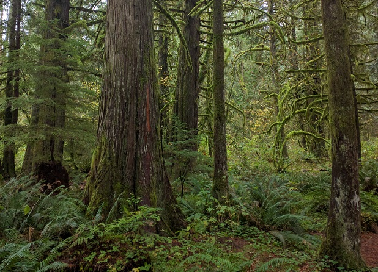
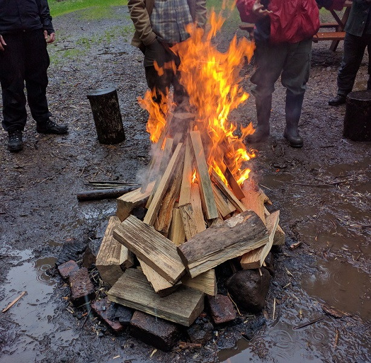
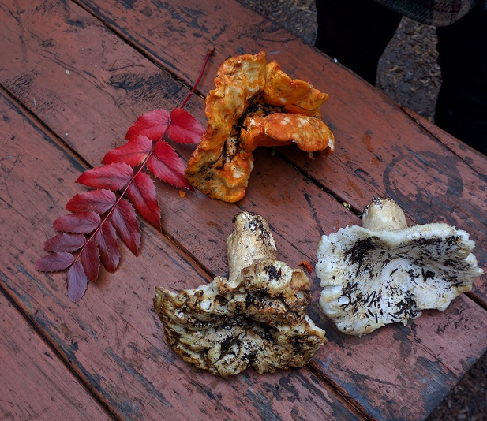

In September, I started a nine month wilderness immersion program to learn more about bushcraft and living outdoors. Once a month, I go camping with about twenty-four other people on a property an hour outside of Portland. The culmination of the program is a week long trip in May where we only bring things we've made or traded for, nothing purchased. My original plan was to write about every month's trip, but it has proven to be way too much information to keep up with on a monthly basis. We've got a break now until the end of January, though, and there seems to have been a turning point in my understanding and experience after the fourth trip. It's a natural time to pause and synthesize what I've experienced so far.

While the program does teach a lot of practical skills, a large part of it is imbuing us with a philosophy of nature. There is a strong Native American influence in the culture of this program, which brings with it a deep respect for life and the patterns of the earth. The goal is not human domination of the nature in the way of TV's "man versus nature" shows. It's quite the opposite - teaching us to learn enough of the natural flow of our habitat to blend in and become part of it. And, along the way, it's giving us a glimpse into what tribal or village life would have been like before modern conveniences or technology.

One exercise we do to cultivate this mindset is called a "sit spot." We all disperse, find a secluded spot in the woods, and just sit and listen. You might not realize this (I hadn't), but when you go romping through the woods, every living creature is hiding out because they know what we seem to have forgotten: we're a great big predator to everything around us. Everything goes quiet as you're rambling through the forest, so the goal of the sit spot is to disappear into the background and wait for the normal state of the forest to return. 

So that's what we do. We sit, and wait, and listen. We listen for the birds (how many? where are they? what do they sound like? how high up are they?), we watch for animals, we pay attention to the vegetation around us (what does it tell us about the climate of this part of the forest?). To me, I think this is the greatest gift of this program - *paying attention* to what's around us and appreciating just how rich and abundant the earth is. 

That's a theme that keeps coming up. On the first trip, we learned a lot about plant life in the area: edible plants like wild ginger, dandelion, and wood sorrel, trees like the hemlock and cedar (the "tree of life" to many native peoples), and other useful plants like stinging nettle or trailing blackberry, which can be used to make cordage. We carved bow drill kits out of cottonwood and hazel (though I still have yet to successfully make a coal with mine) and started making bowls from cedar. We learned how hemlock branches have special properties that make it excellent fire starting material. All of this in one patch of land in one part of the Pacific Northwest.

The second month we learned about processing game and birds. We helped process two sheep and a turkey, and again it was pretty mind-blowing just how much we receive from these animals and how disconnected we normally are from this process. Despite the fact that I grew up in southern Georgia running around farms, I was never involved with livestock, nor have I ever gone hunting (I have no idea how I managed this having lived in the south most of my life). It was honestly a pretty intense experience for me, which I can't help but laugh about, but I'm really glad I did it. We weren't involved in killing the sheep -- the instructors don't ever want to make the death of an animal a spectacle, and want to allow people to encounter death on their own terms -- but we helped with gutting and processing. We used every single part of the animals, and it took twenty-five of us an entire day to process two sheep, from harvesting the meat to fleshing and tanning the hides. I'll certainly never forget the sweet, earthy smell of the sheep's blood or my aching back after fleshing and stretching the hides. The turkey took much less time, but was also used in its entirety, even down to the feathers being used for fletching arrows.

These experiences were such vivid illustrations to me of how we're constantly on the lookout to accumulate in our consumer-focused culture, yet all around us is abundance.

And so I find myself now in this period where I'm going to the Arboretum to get to know trees better, or on the side of the road collecting yellow dock seed and acorns with a friend so we can make flour for our trip, or knee deep in stinging nettle stripping the stalks so we can learn to make cordage next month, or making countless trips to the military surplus store to get more wool. I'm reading a book about birds (*What the Robin Knows*) and listening to clips of bird calls online over and over again to remember them. I finished up my sheep hide in my room (the third month we each got our own to work on from a local butcher) - there's certainly nothing like applying egg to a sheep hide while watching Netflix (you know, the way they used to do it in the village). 

We've covered other ground, too, like navigation with and without a compass, natural water filtration, and some knots and lashing. It's a lot, and I am still a total novice. Later this year we'll cover shelter building, tracking, and learning how to make traps. I'll also get to finish off and sharpen the knife I made back in April.

One of the best parts of this program, though, is getting to know the instructors. They're incredibly fascinating people with the best stories. Scott grew up wandering from Belize to Alaska, and once lived for six months alone in the Canadian wilderness with no money, just his knife. Jamey comes from a Native American tribe that really only entered mainstream American culture about 75 years ago. I love listening to how he grew up, his philosophy on life, and how he's raising his kids. He's also just a hilarious guy and is a member of one of the Portland pirate societies (yes, they exist, and yes, there is more than one). He taught us a sea shanty around a fire one night and it was a pretty great time. Sarah is the botany and homesteading expert, and I learn something new about a plant or animal just about every time I talk to her. And then there's Roman, the chef of the group, who reminds me a lot of Kikuchiyo in Seven Samurai - wild but endearing.

At first each of these weekends, vivid and memorable as they are, seemed disjointed. I'd spend an intense weekend in the woods and then immediately be back at work in front of a computer. By total happenstance, I watched Werner Herzog's *Happy People* on a snow day last week and suddenly it all clicked. As I watched the trappers in Siberia work their year long plan for survival, I recognized so much of what we're learning and marveled at how these people were living with the flow of nature to preserve their (incredibly difficult) way of life. As a young, city-dwelling American, it's possible these days to live so far above the earth, both physically and mentally. We live off the ground, and we're often disconnected from our sources of food or clothing (though in recent years farmers markets have helped assuage this). We are usually surrounded by plastic, machined metal, and furniture that is either mass produced or without a creation story anyone remembers. Certainly there are craft fairs and Etsy stores and artisan furniture, but in our daily lives, we can live outside of the patterns of nature. We don't need to worry much about when the sable's coat grows thick, or that wild ginger grows in moist, shady areas. We don't need to listen to the alarm calls of the birds to know when a predator is coming. We're glued to screens, now.

There's a term that I only first heard since moving here - **rewilding**. I've heard it used in a variety of contexts, but I take it to mean the restoration of both natural habitats and ancient skills. It is a term used by both conservationists and tracking communities, and it is also a useful term for the concerted effort I've made this year to learn new skills and spend time in nature. I've lived in this bizarre state of liminality for the last few years - at the borders of married and unmarried, religious and irreligious, finance and web development, the south and the Pacific Northwest. I'm finding a balance through nature, through rewilding myself. It makes me feel like I'm taking shape outside of the frames of faith or relationship or career.

I guess that might sound obvious or cliche, or maybe even a bit late for a thirty year old (get it together, Sam!). But I'm enjoying it, and in that constant quest for meaning and purpose, I feel like these weekends are pushing me in the right direction.

And hey, even if I don't find meaning or purpose through this stuff, I'll sure be useful if the apocalypse comes.

