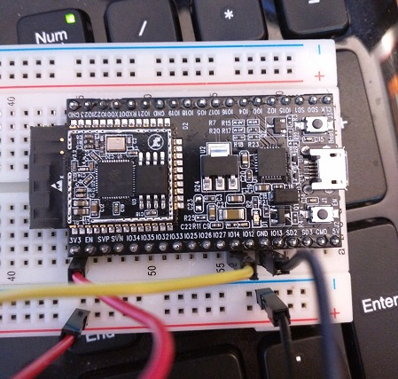
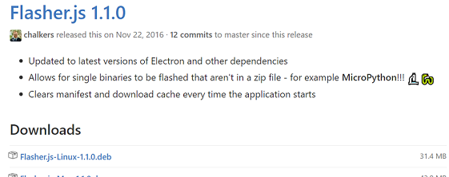
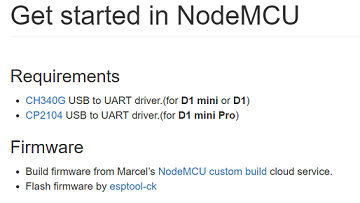
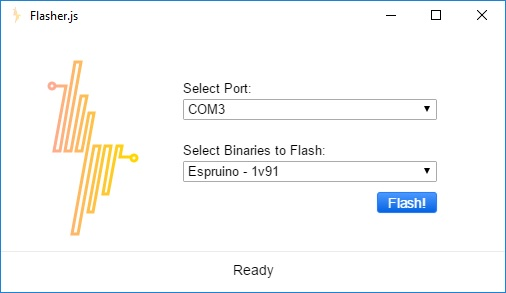

Last year, I did a couple of posts and [several talks](http://samjulien.com/talks) on IoT and functional reactive programming, and I always demo'd my little Arduino photoresistor theremin as a good example of how they work together. Up until now, all of my work on [IoTReX](http://github.com/iotrex) has been using [johnny-five](http://github.com/rwaldron/johnny-five), which sets up a client-host relationship between the computer running JavaScript and the device running the Firmata firmware. I used the Uno for the theremin and an Adafruit Feather Huzzah to wirelessly [read temperature data](http://samjulien.com/johnny-feather).

It'd be better, though, if the device could be less dependent on the host computer by running JavaScript over WiFi. In other words, the device would no longer be a passive recipient of instructions, it'd be running a JavaScript program on its own that just emits data to a client (just like you can do in C - another concept that's so new it's decades old!). The board would serve as the "back end" just like it does in projects using johnny-five, but it would run independently and continuously.

The end goal would be to swap out Firmata with a JavaScript interpreter firmware called [Espruino](http://www.espruino.com/) so that the ESP8266 can send analog sensor readings over WiFi to the rest of the IoTReX stack. The front end could then read and manipulate the sensor data with RxJS like before. That would mean JavaScript from top to bottom, even on the device itself! That's pretty exciting. 

This turns out to be a lofty goal teetering on the bleeding edge, so we're going to take it in baby steps. Hopefully this gradual learning process will also give you a glimpse into the current landscape of modern JavaScript development for IoT.

Speaking of which, here's one interesting side note. There's now actually a bigger, badder cousin to the ESP8266 called the [ESP32](https://www.adafruit.com/products/3269). It looks like this:

Isn't it pretty? It has built-in bluetooth *and* WiFi, lots of memory, lots of inputs, a couple of built-in sensors, and a faster processor. Unfortunately, it is so bleeding edge that not even the [Arduino core](https://github.com/espressif/arduino-esp32) is quite ready for development, let alone things like Espruino. So, unless you're cozy with C, don't worry about it right now. We'll stick with our old friend the ESP8266, with the most common iteration being the Huzzah.

## Wait, back up - how are we going to do this?
 
Our first baby step is get some background in this area and learn about our tools. Our second baby step will be to get Espruino running on the device. 

We're going to use the new [thingsSDK](http://github.com/thingssdk) tool chain from Andrew Chalkley and Craig Dennis developed right here in Portland. At the moment, developing an all-JS photoresistor theremin poses quite a few challenges:

- Since it's not an officially supported board, [flashing Espruino on the ESP8266](http://www.espruino.com/ESP8266_Flashing) manually is a pretty lengthy process, especially if you're not proficient with hardware and comfortable with C. [Flasher.js](http://github.com/thingssdk/flasher.js) solves this problem simply and elegantly, and that's what this article is about. 
- The ESP8266 only has 4 MB of storage, so any code and dependencies need to fit into that. Unlike with johnny-five, we don't have the full spectrum of the NodeJS universe at our fingertips because we're actually running on the device, not on our computer. Luckily, thingsSDK helps us with that a bit with a process called tree-shaking. We'll cover this in the next post.
- Because of the size limitation, we're going to use MQTT instead of HTTP as the protocol for communicating the analog data back to our front end. MQTT is lightweight and meant for this kind of thing. We'll learn about this when we're ready to send and receive data (a few baby steps away!).
- The ESP8266 world is not as developed as the Arduino world yet. It's still highly experimental and quirky, just like the board itself. This might mean changing plans mid-stream, whether on a hardware or software level. For example, I'm hoping to use a photoresistor just as I did with the Uno, but we may end up having to switch to a different type of sensor if the ESP8266 **ADC** is finicky with it. What's ADC? ADC means "analog to digital converter" - the ADC translates an analog input signal to a digital output value. So far, in my experiments and my pals', the ESP8266 ADC has been pretty rough in Espruino. This might put a damper on things.
- Just like the hardware side, Espruino, thingsSDK, and the surrounding software tools are all bleeding edge and wild wild west status. They're likely to change at any time. That's a big reason why I write about this stuff, actually - I want to show other developers what's happening in this space and what it's like to work with these tools right now. The more people use and contribute to them, the better they'll get.

Okay, let's get a couple of definitions laid down and then get set up.

## So what is Espruino?

Espruino is a firmware for microcontrollers created by Gordon Williams that interprets JavaScript. It's written in C and is designed for devices with as little as 128kB Flash and 8kB RAM! There are officially supported boards like the Espruino Pico, as well as unofficial boards like those with the ESP8266 chip. 

Using Espruino, you can require basic dependencies, run a script, and interact with a REPL directly on the board. Espruino also contains the API for interacting with the pins on the board and whatever is connected to them, with syntax similar to Arduino. It's a seriously impressive piece of software and is completely open source.

The default development environment for Espruino is a web-based IDE that you can run in Chrome, and while that's nice, it isn't ideal for anything substantial. That's where thingsSDK comes in.

## ...and what is thingsSDK?

ThingsSDK is the umbrella project for the efforts of [Andrew Chalkley](http://twitter.com/chalkers) and [Craig Dennis](http://twitter.com/craigsdennis) to build a sensible, professional developer tool chain for IoT development in JavaScript. Other folks (including yours truly) have started pitching in on the tools, as well. The tool chain as of now consists of:

- Flasher.js, an Electron app for flashing Espruino or other firmware binaries to compatible boards
- thingssdk-cli, a CLI tool for generating new apps that use Espruino

The projects generated by the CLI have three different pieces:

- Middleware (called "strategies") for transpiling the JavaScript you want to run (currently only for Espruino, but this will be expanded in the future). Strategies also use a JS tool call Rollup which bundles only the modules you need for your project. Handy for saving space.
- thingssdk-deployer, which talks to the board over serial and pushes your scripts to it.
- Modules, which are drivers for peripherals wrapped in ES6 that you can include in your thingsSDK project. Andrew just released the first one, which is a driver for [Adafruit HT16K33 matrices](https://github.com/thingsSDK/ht16k33).

There are a couple of other things planned for the future, like a WiFi configuration tool. You can see those on the [thingsSDK website](http://thingssdk.com/).

So, the idea is that, after flashing Espruino with Flasher.js, you can generate a new project with the CLI, write your code to do what you need (like read from a sensor or connect to a server), and then deploy to the board with the npm script `npm run deploy`. I don't know about you, but that sounds easier than even most front-end build processes these days.

## Enough chatter, let's do this!

Okay, now that we're square on terms and background, there are three steps to flashing the board:

1. Download and Install Flasher.js
2. Install the Drivers
3. Flash the Device

### Step 1: Download and Install Flasher.js

First, head over to the [Flasher.js releases page](https://github.com/thingsSDK/flasher.js/releases) and download the latest version for your OS. There are binaries for Linux, Mac, and Windows (both 32bit and 64bit). You can also compile the source yourself. 

On Windows, you'll be downloading the binary directly, so you can just move it where you'd like it. On a Mac, you'll be downloading a disk image (.dmg) file. Double-click it and drag the Flasher.js icon over to your Applications folder. If you're on Linux, you'll be downloading a Debian package (.deb). Double-click it to install.

### Step 2: Install Drivers

Before you open up Flasher.js, you are most likely going to need to install some drivers for your board. If you're using the Huzzah, you'll need [these drivers from Silicon Labs](https://www.silabs.com/products/mcu/Pages/USBtoUARTBridgeVCPDrivers.aspx). If you're using the NodeMCU V3, you'll need [these CH340G drivers](https://www.wemos.cc/tutorial/get-started-nodemcu.html) for Mac. 

If you have any trouble doing this in El Capitan, check out [this workaround](https://tzapu.com/making-ch340-ch341-serial-adapters-work-under-el-capitan-os-x/). We also keep all this info in a [compatible devices](https://guides.thingssdk.com/flasher.js/compatible_devices.html) chart in the Flasher.js guide.

Once you've got the right drivers installed, you're ready to actually flash the firmware.

### Step 3: Flash Your Device

Okay, this is the fun part. Plug in your device, then double-click on your freshly installed Flasher.js binary. You'll see a screen like this (with slight differences for your OS):

Flasher.js will attempt to auto-select the port for you, but you can double check it. On Windows, these are going to look like `COM3`, while on Mac and Linux they will be more like `/dev/ttyUSB1` or `/dev/cu.usbmodem150`.

Flasher.js comes with many different binary options in that second dropdrown. In addition to Espruino, you can use this tool to flash [Mongoose OS](https://mongoose-iot.com/) (formerly Smart.js), [thingsSwitch](https://github.com/thingsSDK/thingsSwitch), and even [MicroPython](https://micropython.org/). For our purposes, you can just leave it on the latest edition of Espruino, which is the default.

And now - the moment you've been waiting for - click the Flash! button. Flasher.js will go download the appropriate binary for you, prepare it, and flash your device - all in one step!

While it's flashing, you should see your LED blinking.

This should only take a minute or two, and then, voila! You're all set to start on the rest of the thingsSDK toolchain and build your project.

### What do I do next?

You have two different options once you've got Espruino flashed on your device to continue tinkering.

First, you can grab the Espruino Web IDE from the Chrome App store and set it up to work with your device. The Espruino site has this [very helpful tutorial](http://www.espruino.com/Web+IDE) on how to do this.

Second, you can earn extra credit by going ahead and trying out the thingsSDK CLI. The [thingsSDK guide](https://guides.thingssdk.com/thingssdk_cli/getting_started.html) has several tutorials to help you get up and running fast in ES6. I'll be covering creating projects with the CLI in more depth in my next post.

Whichever path you take, tweet about what you've created so we can all see and celebrate. We always say at our local JSoT meetup - in this space, literally no project is too small. Making a light blink is always a cause for rejoicing, but especially when it's blinking due to JavaScript running natively on a ESP8266 chip!

*Thanks to [Josh Tompkins](http://twitter.com/jtompkinsx) and [Jared Pinchot](http://twitter.com/mildsauce45) for help with editing, and for the entire Portland [JavaScript on Things group](https://www.meetup.com/JavaScript-and-the-Internet-of-Things/) for getting me into this stuff in the first place and (being generally amazing).*
