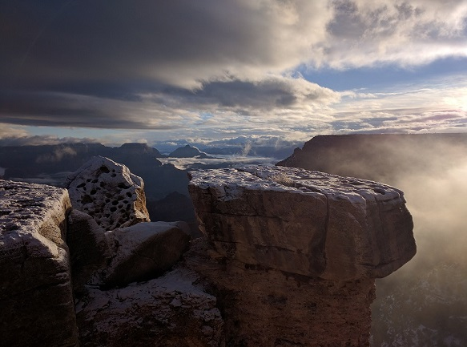
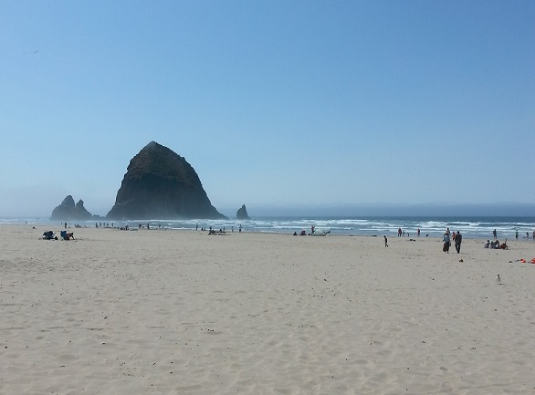
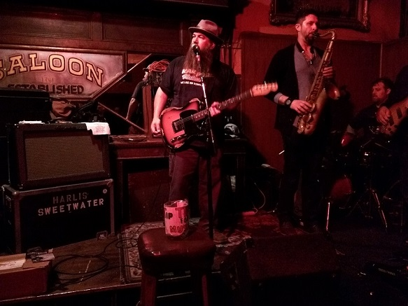
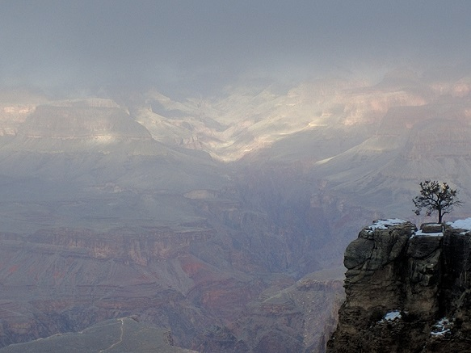

It's New Year's Eve. I'm drinking champagne from my camping mug in front of a fire I built (gotta put those wilderness skills to good use). I'm roasting s'mores with Justin and Lexi, the young couple from San Diego staying at the campsite next door. Joanna, my friend from LA who has become my kid-sister-adventure-buddy, hands me a beer. We had gotten lucky - the previous night, a couple in the Navy had offered to share the campsite with us after we had fruitlessly driven around looking for an available space. The hard rain of last night had turned to snowfall in the morning, and tonight it's clear and cold, with that chill that rises from the earth after a fresh snow. In the midst of our drunken laughter we hear a pack of coyotes in the distance howling at a fresh kill. We stop in terrified silence for a second and then explode in laughter, while I try to assure everyone that sound carries in flat desert areas. The next morning, as the fog lifts, the sunrise at the Grand Canyon proves to be the most beautiful way to ring in 2017.

A year ago I didn't even know Joanna, and now we're pals who have seen Seattle, Southern California, and a fog-filled, snow-covered Grand Canyon together. And, while that may be the best story from living in an AirBnB, it certainly is not the only one. 

In July 2014, I visited Portland for the first time. I was freshly divorced, discontent with my career in finance, and antsy to leave Florida. I came to Portland to see if it was perhaps that promised land of escape I was seeking. I decided to give AirBnB a try. Keep in mind, this was summer 2014, so AirBnB wasn't the household name it is today (especially in Florida). I had no experience with Portland, no idea of the layout, so I had no rational process by which to decide where to stay, but I found myself drawn to one particular listing. [This is the part where an engineer at AirBnB reading this will yell at me about algorithms and how nothing is random.] There was something different about the hosts; I could tell in their description of the room and in their introductory video. Despite objections from an old high school friend in Portland about how far southeast the place was, I booked it.

I quickly became friends with my hosts while falling in love with Portland and the Pacific Northwest. I had already begun the switch from finance to development, and when I was offered a web job out in the Portland suburbs in October of 2014, I gave them a call to see if they had any leads on where to live. In perhaps the greatest stroke of luck in my life, they had just bought a rental property and offered me a room. It'd be an unusual situation - just me and several rooms of AirBnB guests - but it amounted to a win for both of us. They got regular income from my rent and someone at the house overnight, while I got to stay at an amazing place as soon as I got to Portland. I basically struck the housing lottery - and that was only the beginning.

Those early days at the house are filled with nostalgia for me as I explored Portland surrounded by constantly changing roommates from all over the planet. My landlord is a formidable cook, and he would come make breakfast on the weekends for the guests and include me. On so many Saturdays and Sundays I'd sit at the breakfast table, drinking coffee and eating unconventional breakfast dishes like split pea soup or lentils and toast, listening to the stories of travelers. Some were from northern California or Washington, like the couple from Sonoma who brought us coffee they roasted themselves, but we had people from many states and countries. As I was learning the city, I'd swap ideas with the guests and show them around to places I knew. They'd also introduce me to places they'd found on Yelp, like when Brooke and Skye from Salt Lake City took me to Dig a Pony for the first time. I ended up pretending to be Brooke's long time best friend in order to help her shake off a weird dude.

There are many stories like that, and somehow most of them revolve around eating and drinking. I've eaten pizza with an Australian slam poet, sandwiches at Lardo with an Indian businessman, and Lebanese with a woman from Toronto who had quit her job in chemistry and decided to travel around America. I've been to my neighborhood bars with more people than I can remember, like a nearby speakeasy with an British Muy Thai fighter and his wife. Once, I came home from work and there was a silver-haired man I didn't recognize sitting at our dining room table. He was wearing a maroon shirt, accompanied by an open bottle of red wine. He looked up from his glass, introduced himself as Dave, and asked me to join him. It turned out he was once a professional musician and was now training to be a sommelier. A few minutes later, another guest, a middle-aged woman from Hawaii, came out from one of the other bedrooms and joined us. We had a great time talking about all kinds of things, three people who were completely unlikely to meet in normal life, nor would we likely ever meet again. And man, it was good wine.

Much of what makes these stories great is the intersection of so many timelines as one-time occurrences over food and drink. It's amazing what sharing a meal or a drink with a stranger does. Suddenly, you're no longer strangers, just new friends. And while most of our previous guests I probably won't see again, a few have ended up becoming friends, like Joanna. Prior to Joanna I had met on separate occasions Jeffrey from Austin and Julian from Germany, both of whom I ended up seeing in San Francisco at the same time. I can't tell you how bizarre and amazing it is to be watching a blues band in San Francisco with a friend from Germany that you met in Portland. Life is a funny thing.

Of course, as all things do, our house changed. Occasionally, one of the AirBnB rooms became a short-term living situation, like for Jeremy from Fort Collins or Sebastian from South Florida or Daryl from San Francisco. These folks I'd get to know well, at the diner down the street, at the dinner table, in the backyard talking about music. There was also one more roommate who only stayed about three weeks. In those three weeks, though, I actually went to Mount Hood for the first time with him and saw Trillium Lake. I have this random memory of us eating kale and chicken with Cholula hot sauce in the car on the way as he swore to me he was going to quit smoking cigarettes. His was a sad story, an injured veteran, but we weren't remotely equipped to give him the help he turned out to need.

Then in May, my landlords decided to consolidate, get rid of the other house, and move their family into the house I'm in. There's still one room open, but it's decidedly different from that first year. My landlords-turned-housemates are some of my closest friends, and I have lots of stories about the impact they've had on my life (I'll write about those soon enough). I'll still look back fondly on all those times of exploring the city while living among travelers, though. It was like getting to see the world without going anywhere.

The biggest lesson that first year and a half taught me was just how many good people there are out there. Granted, the sample size was small, but I met people from all over the world with a wide variety of different backgrounds, dreams, and goals. All but a few were kind and positive, and some I hope to maintain friendships with for years to come. There is so much profit to be had in fear and division, of keeping people pitted against each other. The truth is, people are the same at the core, and most of them want to get along.

I've been reading Rolf Potts' famous *[Vagabonding](https://www.amazon.com/Vagabonding-Uncommon-Guide-Long-Term-Travel-ebook/dp/B000FBFMKM/ref=sr_1_1?ie=UTF8&qid=1488142197&sr=8-1&keywords=vagabonding)* lately and am making plans to travel. In a way, my first two years in Portland have been a form of vagabonding, just confined to a particular geographic region. The lessons learned have been similar: when you go looking for friendship and adventure, you will almost always find it. And, as the saying goes, "you have friends all over the world -- you just haven't met them yet." Striking up a conversation with a stranger may lead to nothing. Sometimes, though, it will lead to a new adventure, whether simply a drink with a fascinating person or a road trip to the Grand Canyon.

