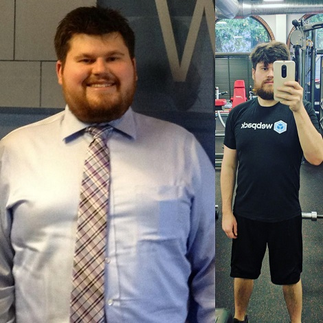

A bunch of people have asked me how I have lost so much weight, so I'm going to save some time and write it all down.

I grew up a heavy kid and struggled with weight my entire life. Without boring you with my life story, I was always that kid who was teased relentlessly and avoided pool parties and beach days at all costs. The most annoying thing, though, was that I started trying to change that at 16 years old with varying degrees of success. I tried a bunch of different diets and exercise programs, would lose nominal amounts of weight, but gain it back. None of the things I did really took root as psychological changes or affected my relationship with food.

I finally was able to change that at the end of 2015 thanks to the help of my housemate along with some friends and exercise instructors. I've lost 60 pounds in the last year and a half while at the same time paying off debt, beginning to learn skills like blacksmithing and woodworking, improving my career, and participating in a wilderness skills program, among other things that I've written about on this blog.

I've also learned the fundamental keys to changing habits:

- Take away your free will.
- Observe your behavior.
- Do what gets quick wins and ignore the rest.
- Adjust the details over time as you figure out what works and what doesn't.

Let's take a look at the results of my experiment.

## The Results
Here's me at my highest weight, 242 in 2014, versus my current weight:

Here are the numbers:

**Round 1:** 12/30/2015 - 6/30/2016  
**Starting weight:** 235  
**Ending weight:** 205, lowest was 195

**Round 2:** 1/6/2017 - Present  
**Starting weight:** 203  
**Current weight:** 173

So, what exactly did I do? I built a system for my health over time using 4.5 tools (yes, 4.5).

## Tool 1: Intermittent Fasting
No other change in my life has produced such a significant psychological transformation in my relationship with food than intermittent fasting. I chose to embark on IF after a lot of research. It's main use is to decrease insulin resistance and thus reduce abdominal fat, which was my primary goal.

### Round 1
#### What I did  
Strict 4 hour window, eating from 4pm-8pm or 5pm-9pm every day. Water, black coffee, and tea only during fasting time. No food restrictions at all. I originally agreed to do 90 days of this with my housemates, so I set a countdown starting at Day 90 and marked off each day. I have found countdowns work much better than count-ups when it comes to developing new habits.  I ended up repeating that 90 day cycle multiple times.

#### Notes   
Intermittent fasting fit me like a glove. I was very scared to try it, as I was terrified of low blood sugar and being hungry all the time. The first few days were indeed very hard, but I adapted much faster than I originally anticipated. I noticed a few key things:

First, it was much, much easier to simply say "no" to every offer of food during my work day than to make a million decisions about what and how much (how little) to eat. I could simply make one decision: no. 

Second, if I had any particularly difficult temptation, I could just tell myself I'd eat it later. 80% of the time, by the time I got to 5pm, I had forgotten what that temptation was.

Third, I found it incredible that, despite how hungry I was, I literally could not eat an entire day's worth of food within 4 hours. This is what made the first round of IF so effective. I easily was eating half of what I normally ate. I was also spending way less money on food.

Fourth, I became much more mindful in my eating and begun to connect what I ate with how it made me feel. Early on in IF, I remember being exceptionally ravenous and getting a giant burger with a mountain of fries from Killer Burger. I devoured the entire insane amount of food, and minutes later, I felt like a bomb had gone off in my stomach. I wasn't used to such immediate feedback and it had a powerful effect.

Because IF clicked so well with my psychology and personality, I immediately started getting quick wins, which is super important in any sort of behavioral change. Of course the first few weeks I dropped unusually large amounts of weight, but then it averaged out to your typical 1-2 pounds per week. The weight loss tapered starting in April 2016 and stabilized completely in June.

I'm not alone in this experience by any means, and if you'd like to hear a similar perspective, my thoughts are almost identical to General Stanley McChrystal in his interview on the [Tim Ferriss Radio Hour](http://tim.blog/2017/04/06/the-tim-ferriss-radio-hour-control-stress-upgrade-nutrition-mindset-of-a-gladiator/). It starts at 6 minutes in and ends around 19 minutes.

### Round 2  
#### What I Did 
Roughly a 5 hour window, 5-10pm. Keto diet (see tool 4).  

#### Notes  
Since I had plenty of experience with fasting at this point, I didn't have to make many changes the second time around. I have been a little more lax on the specific window of time because 1) I have less weight to lose and 2) I know that the minimum fasting window I need is 12 hours. The big change with round 2 was adding in a (slightly modified) keto diet, so more on that in a minute.

## Tool 2: Bulk Cooking
Bulk cooking is another way to take away your free will and reduce the number of decisions you need to make around food. It also has a double bonus of being a heck of a lot cheaper.

### Round 1 
#### What I Did 
Myself, my housemates, and several of our friends (5 total, we gained and lost one or two over time) would each cook 1 large meal with 10 servings (no dietary restrictions). We would each bring 10 containers and fill them for freezing - 2 containers per bulk meal (5 meals, 2 containers, so 10 containers). We did this every two weeks. Average cost: $35/two weeks for 10 meals.

#### Notes  
Bulk cooking helps reduce the mental burden of planning every meal. It also helps reduce or eliminate the temptation to get off track. In this first round, we didn't bother with restricting what people could make, so we had a lot of variety. The only problem was the regularity - it was tough getting people to commit to biweekly shopping and cooking. 

### Round 2  
#### What I Did 
With my housemate, we shopped for and cooked 5-7 bulk keto meals together, divided everything in half, parsed it all into 30 single meal containers, and froze. We did this once per month. Average cost: $90/month for 30 meals, plus roughly $10/week for perishables like salad stuff.  

#### Notes  
When my housemate and I decided to go grain and carb free for this round, that eliminated interest from our friends (no ability to make lasagnas or enchiladas!). We found the biweekly cook too cumbersome to stick to with our busy schedules, so we moved to monthly. This obviously means a longer cooking time, so we would do roughly 4 hours of cooking on one Sunday and then finish up the remaining cooking in the first few days of that week. The idea is to get everything cooked and in the freezer as fast as you can, though, to keep up that momentum.

## Tool 3: Modified Ketogenic Diet
Adding keto was the next major change I made. I had tried to go paleo many times but had never tried keto. I repeatedly failed at paleo because it was too drastic, too expensive, and I felt like I was constantly hungry.

### Round 1 
I didn't restrict my food in any way during round 1. I wanted to focus on reducing quantity and changing my relationship with food.

### Round 2  
#### What I Did 
Cut all grains and carbs, except for small amounts of fruit and 85% dark chocolate. I actually did not count my carbs, I found it much too cumbersome. I simply cut out large swaths of food and let my body tell me through weight loss if it was working.  

#### Notes  
Cutting out flour and sugar is the second biggest change I experienced in this series of tests. The trick was to kick it entirely, not to reduce it. I had cravings for the first few days, but they went away and magic started happening. I noticed a much more stable mood, much more energy, and a lot of clarity. I no longer felt any fog, and I no longer craved sweets. I can now stare at a box of Voodoo donuts and feel absolutely nothing. I can give away a box of Girl Scout Cookies without a second thought. It's insanity I never thought possible. It also made the IF way easier as I was no longer chasing sugar throughout the day. I also found I was much more successful on keto than paleo because of being able to eat dairy. The added fat and protein helped a ton with satiety. I did not stress out about over-eating things like cheese, nor did I count calories in any way. Cutting out things like pizza and pastries did most of the work for me.

I'm getting to the point in my weight loss where I will be modifying this soon, as I have less and less fat left to burn. My ideal diet would actually be closer to paleo, as right now I don't eat sweet potatoes. I do love lentils, though, and paleo excludes that. I'll figure it out and experiment more over time.

## Tool 4: Journaling

### Round 1 
I did zero journaling in the first round. I did keep a running countdown of each cycle using WhatsApp group chats or Google Keep depending on whether my housemates were doing each cycle.

### Round 2  
#### What I Did 
Wrote down every single thing I consumed and what time in a running Google Doc, in addition to exercise and notes on mood. I started measuring my food about one month in. 
 
#### Notes  
I did not bother with counting calories, because I got way too stressed out about perfection. I tried logging at first with MyFitnessPal, but if I ate anything I didn't make or buy myself, I got too discouraged. I found it much more effective to just write down in a Google doc things like "5pm one egg, salad, pork, peanut butter" rather than obsessing over calories. I did take two or three months to actually measure out what I was eating, but without trying to change it. This helped me make the connection between quantity of food and satiety. I also found that sugar is what skewed my hunger levels -- once I cut that out, I was able to eat until I was full and not need to keep eating.

## Tool 4.5: Exercise
### Round 1 
#### What I Did 
Lifting heavy multiple times per week (3-6x, it varied over time). I kept a physical notebook with me to log every workout and what I did. Starting in April or May I begun biking and doing yoga twice per week.  

### Round 2  
#### What I Did 
Lifting less frequently (2x/week), but still logging it. Occasional yoga. Kung fu and tai chi 1-2x each per week. In April I began to add in treadmill running 1-3x per week.  

#### Notes  
Here's the thing: 80% of weight loss for me has been related to my diet. Exercise became about manipulating my energy levels, getting strong, getting flexible, and most of all: having fun. Exercise serves to reinforce my diet and as a way for me to test my limits.

I found I had a bunch of false beliefs about the connection between food and exercise and my abilities. Contrary to my original preconception, fasting and keto only served to enhance my ability to work out in any capacity. The better my protein intake was the night before, the better my workouts were. The bottom line turned out to be: just do it.

Now that I've lost a bunch of weight, I'm in fine tuning mode. I am experimenting with how frequently I do yoga and martial arts, treadmill running vs. outside running, and different ways to maintain flexibility. In the beginning, none of this really mattered for weight loss.

## Key Lessons
The biggest lessons for me in this time have been:

- **Don't get lost in the details.** All the minutiae surrounding calories and recipes and exercise routines are not nearly as important as the sweeping behavioral changes that produce results. Focus on the big changes, allow yourself to make mistakes, and fine tune over time. Consistency is way more important than details.

- **Put systems in place where you can.** Reduce the number of decisions you need to make. In other words, set yourself up for success.

- **In the end, nobody else really cares or matters when it comes to your health.** This is a big one. Worried about your coworkers judging you for not eating lunch? Or your family not liking your diet choices? Or some random stranger thinking it's weird that you brought a protein shake and container full of pork curry to a coffee shop? Guess what: it doesn't matter. The best approach I found was to simply be honest and confident, not to beat around the bush or offer any sort of apology. "You're not eating lunch with us?!" "Nope. I do something called intermittent fasting and only eat from 4-9pm. I've lost 20 pounds so far. It's awesome." Most people will be either jealous, supportive, or indifferent. 

- **Do not make exceptions.** These processes were completely front loaded. Adapting to IF and keto was very difficult for a few days or a week each, but then a cinch to maintain. The more I stuck with them, the easier it was to stick with them. It's extremely important to hold frame on this. Do not make exceptions for weddings, conferences, special occasions. Get the work done. It's not going to be this way forever, it's a temporary extreme measure to reorient your body composition that is entirely worth doing. Again: consistency is more important than details. 

I should also note that I periodically checked in with my doctor and he was fully aware of what I was doing. Obviously you need to do the same.

That's about it. It's been a wild ride that has fundamentally shifted my self-perception, and I hope by sharing what I've learned I can help others do the same. It may look different for you in the approach, but the principles will translate: reduce the number of decisions you need to make, stay consistent, and go for the quick wins over perfection.