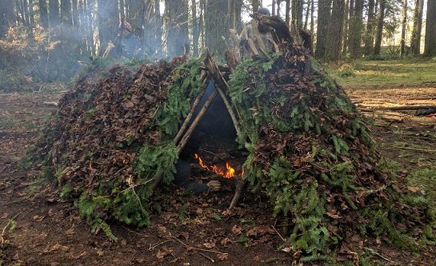

I began 2017 standing at the edge of the Grand Canyon and making a decision to be wildly optimistic and obnoxiously grateful, both publicly and in my own mind. I let that dazzling beauty work its way into my heart and decided to let that moment dictate the rest of the year. It worked - but not just for my own well-being. I received lots of messages and kind words over this year about how _badly_ people needed that, how my positivity has "kept them going." It is hip to be cynical and to be paralyzed by despair, but despair never motivated anyone to change. I decided to opt out of that bullshit, to stop being beholden to all of my untested delusions of failure and to focus on what's under my control - and do so with gratitude.

With that decision came a big year for me, one filled with love, adventure, and learning. I finished my wilderness survival program, built [my first video course](https://www.upgradingangularjs.com) (200 screencasts and counting) and fixed several physical problems. I'm starting 2018 much healthier than 2017 (despite a back injury that threw me off track for a bit). I am still on a journey to becoming the best version of myself, and I still have a long way to go, but I am learning tons along the way and documenting my progress.

There's one pattern that kept repeating this year, whether it was in my career, my health, or my relationships. I've been calling it The Feedback Loop, and it looks like this:

1. Do something.
2. Do it quickly.
3. Do it consistently.
4. Adjust and repeat.

Let's break this down piece by piece.

# Do something.

The first thing I've learned is to actually _do something_. Literally anything. Don't just sit there planning and scheming and living a fantasy life. Pick something you're going to do in any area in which you're trying to improve. Not a hundred things, not three things. Just one thing: one new habit, goal, or project. The key is to make it specific, measurable, and something you can act on.

**Bad example:** "I'm going to write a book someday." (No you won't. At least not like that.)
**Good example:** "I'm going to write every day for 90 days."

**Bad example:** "I'm going to get healthy this year." (What does that even mean? No you won't.)
**Good example:** "I'm going to do strength training 4x/week for 30 days."

"But Sam," you might be thinking, "what about all the _other_ stuff I want to do? What about all my grandiose plans?" I get it. Two things really helped me this year with that: singular focus and being in the present.

## Ditch the multi-tasking.

First, I had to _let go of multitasking_, both on a micro level (doing two things at once) and on a macro level (trying to accomplish two goals at once). Until recently, I've always lived with this delusional idea that multitasking is somehow superior to singular focus. We're primed to think that way now that we're tethered to screens all day long. It turns out that's just wrong. We're not built for that. We're built to achieve one goal at a time. Back in the day, you couldn't build a shelter and hunt an animal at the same time. That was never going to happen. You had to do one thing at a time. And, speaking from experience, building a shelter takes a freaking long time and a ton of energy, so hunt accordingly. See exhibit A of a fire shelter I built with five other people last year over about 6 hours:

I also found that it's _easier to eliminate stuff from your life_ than to magically free up more time in your schedule. You've probably heard of something called the [Pareto Principle](https://en.wikipedia.org/wiki/Pareto_principle): that 80% of results come from 20% of effort. When I decided to build my tech education course, I had to start cutting my commitments to free up more time. In America we have this obsession with DOING ALL THE THINGS and saying yes to EVERYTHING, no matter how much we dislike it or how little it actually yields results for us. I had to cut the stuff I was only doing because I thought I was supposed to. You can read more of the nuts and bolts of this process in [The 4-Hour Work Week](https://www.amazon.com/4-Hour-Workweek-Expanded-Updated-Cutting-Edge-ebook/dp/B002WE46UW/ref=sr_1_1?ie=UTF8&qid=1516302900&sr=8-1&keywords=4+hour+work+week). It's good content, though I've said before I always get a little cringed out by Ferriss' Silicon-Valley-Playboy-tone in his books. Get past that though and extract the bits that are useful. For me, learning to cut out the things not yielding results has been a big help.

## Stop lying to yourself.

You've eliminated the cruft, but being in the present is also a huge part of this. I've had to learn to get myself grounded in _reality_, not my mind's grandiosity. I don't know about you, but I lie to myself all the time. To get a clear sense of what I should be focusing on, I have to start by forcing myself to live in the present and admit where I actually am, not where I want to be. Once I am grounded in reality instead of my dreams, I can identify the next step. How do I do that? By looking at my _results_, not my intentions. If I want to write a book, but haven't written more than a sentence in the last 5 years, I'm living in a fantasy. If I want to own a restaurant, but haven't worked in a kitchen, I'm living in a fantasy. You have to crawl before you can walk, and you have to walk before you can run.

So, to sum up: cut out stuff that isn't making you happy, ground yourself in reality, and then pick your One Thing in an area you want to improve. Once you've done that, you can hurry up and fail.

Yep, you heard me.

# Do it quickly.

I have always been a chronic over-thinker, a classic case of Paralysis by Analysis. I always have way too many good intentions or good ideas that turn into nothing. I've noticed that problem in my friends too, particularly the ones that would score high marks in both intelligence and compassion. People like us _want_ to help the whole world or to do something perfect and brilliant - but that is exactly what keeps us from acting. We're afraid of doing it imperfectly and besmirching some bullshit, perfect image of ourselves. Here's what I've learned this year: **taking action on one idea (no matter how simple) is worth more than writing out a whole book of ideas.**

But how do we do this? How do we get out of the quicksand of thinking too hard because we're afraid of failing? Instead of over-thinking in order to avoid failure, we have to take action quickly and fail fast.

Let me repeat that. Instead of avoiding failure, run to it. **Fail as fast as you can** in your One Thing.

Failing fast is the key to the Feedback Loop, because taking action deflates the lies we tell ourselves. It's way easier to see this in the physical world than in the world of ideas. If I lie to myself about being able to deadlift 500 pounds, the second I actually go to the gym and load up the weight that balloon is popped. It's the same for all those other identities we hold onto: writer, musician, artist. Are you actually a writer? Or do you just fancy yourself a writer because you won some awards in high school?

But say you set a goal to [start writing 750 words a day](http://750words.com/), and you do it for 90 days. Lots of things might happen in those 90 days. You might fail to write your book. That's okay: you might get the inspiration for a totally different book, or attract an offer for a guest blog post. You might decide that it actually takes 1000 words to get you in the zone. You might find that writing at 6am is much better for you than 10am. You might have just done enough to turn on the creativity spigot to really write that book this year.

But guess what? Now you're a writer again. Not just in your head. Not just in your dreams or your memories of being young, but in _reality_. None of those things can happen until you put words on the page.

I wanted to get into tech education. I had all kinds of dreams of what that would look like, but hadn't done anything yet. Then I partnered up with two people and made a huge commitment to produce content. It turned out to be way harder and much more work than I thought it would be: I had about 200+ screencasts I needed to make. Fortunately for me, I had given up my free will by making this commitment, and people were counting on me to live up to my word. So how could I could possibly tackle it?

Like a good Perfectionist, I started by over-thinking it. I tried to meticulously plan out the curriculum and the sample code. I did anything I could to avoid actually _doing the work_, until my business partners said to me: "Dude, just make 5 videos for us by the end of next week so we can see you're actually serious." Guess what? I made the 5 videos. They kind of sucked - the volume was too low, my pacing was wrong, and they took me forever to make. I learned so much in the process, though, that it cured my overthinking inertia. I was off and running. The next week I made another 5 videos for my partners that were a little bit better. I found the process to be a lot like woodworking. You can plan up to a point, but then you start making cuts in the wood, gluing things together, and making mistakes, and the project takes on a different, more complex shape than you ever could have planned for in your head.

And then I made 5-10 videos every week for six months - which brings us to our next point.

# Do it consistently.

When I was [going to PT to fix my knee](http://samjulien.com/pt-lessons/), I had this one seared into my brain. Consistency - sticking with the exercises day in, day out, especially when I didn't feel like it - was the number one factor in my improvement. It wasn't the big dramatic movements. It was the slow, controlled exercises that I did over and over again. [With my diet](http://www.samjulien.com/how-i-lost-60-pounds/), it wasn't a week of good decisions, it was a year. With learning how to camp and [survive in the wild](http://www.samjulien.com/wilderness-immersion-1/), it wasn't one tough night. It was camping every month, whether in wind, rain, snow, or sunshine, that taught me the biggest lessons.

When it came to making the screencasts for my course, I committed to making at least 2 videos a day, every day. Some days I could only get 2 done, others I would get 5 done. Just like with physical therapy, it was slow and difficult at first. At first, I had to trick myself into getting started after working at my day job by promising myself I would record at least 30 seconds of video each night. (This is a useful mind-trick, by the way. Try it with flossing - promise yourself you'll floss just one tooth every day and see what happens.)

Gradually, I got more efficient. I started learning editing tricks with my video software and keyboard shortcuts with my code editor. I got more confident in my narration and instruction. I got better at my day job writing code because I was hyper-focused on making these videos the best they could be. It took about a month of consistent action for this to start happening for me, but when it did, it paid off in spades.

When I hurt my back this fall, I went back to the same PT for a session or two, but the prescription was the same: 4-6 weeks of exercises, 3+ days/week. Slow, consistent, methodical healing. It worked, but I had to put in a lot of time and work _consistently_.

# Adjust and Repeat

We've already touched on this part a little bit. Whether you're writing for 90 days, making 200 videos for a tech course, or following a specific exercise regimen, you're going to gradually improve and refine over the course of doing your One Thing.

I like to take it a step further than that and make it more structured with a defined timeline or end point. For health or lifestyle habits, I do 30 or 90 day increments. It takes about 30 days for me to adapt to something new, and 90 to really start seeing results. For projects, I use a different milestone. With my video course, I had defined a course "module" as a unit of teaching material, so each module I stopped to do a review.

In software development, we have something called a Retrospective at the end of each development cycle. This is a formal meeting and process where we review the work we've done and how we can improve going forward. You can make your personal Retrospectives as loose or as formal as you want, just actually do it. A lot of people skip this part (as do a lot of software teams), but it's my favorite, because I get to see how far I've come. I evaluate the following:

- What's working?
- What's not working?
- What's my next goal?

Let's use the example of writing again, since that's fresh on my mind as a personal goal. Let's say I've done a 90 day experiment of writing every day. I can go back and look at which days I've missed, which days I was really flowing, and surrounding events. I might notice things like:

- I write best in the morning after I've done some reading.
- I missed more Saturdays than any other day.
- The days I was really writing well were when I wrote over 1000 words.

From there, I can adjust course and start another experiment. Instead of writing 750 words a day, I'll aim for 1200 words a day. I'll rearrange things on my Saturdays so that I'm more likely to get my writing done. Maybe I've had an idea for a book, so my goal is to write a chapter a week for 8 weeks and re-evaluate.

At the end of the day, these self-improvement experiments are just that: _experiments_. Or even more fun: _games_. For me, it's not drudgery to try to get better (even though the daily grind might feel that way). My goal is to be slightly better today than I was yesterday, and however I need to gamify that to make it happen, I'm fine with.

# The secret sauce.

We've reviewed the pieces of The Feedback Loop that I've learned this year, but there's a secret weapon that has kept me going: **optimism**. Optimism is not just hippy-dippy feel-goodery, it is a powerful tool. I made a choice last year to be exceptionally, obnoxiously grateful and positive. This wasn't because everything seemed rosy and perfect. In fact, it was the exact opposite in that moment. I was being told the sky was falling and I was discontent with my own path. I made the choice to be positive as an experiment. What did I have to lose? It's not like deciding to be grateful could make anything look worse.

It's easy to dismiss gratitude and optimism as hand-wavey and the emotional equivalent of sticking your head in the sand. That's not what I've found. I've found that I'm able to look _harder_ at my problems, to allow myself to stop lying about where problems are and how bad they may be. I'm not beaten down by fear and uncertainty, I'm coming from a place of abundance and strength. So, when a setback comes up, I practice looking at it straight in the eye and trying to learn from it. That's not to say I don't get grumpy or frustrated. Bad stuff sucks. I was really pissed off at myself when I hurt my back. I hated being immobile and needing help from people. Even so, once I was done throwing my tantrum I looked for (and found) the lesson in it.

# Let's go.

2017 was a good year for me, and not just because I finally admitted how much of a genius Kendrick Lamar is or started listening to Run the Jewels. I started this process of becoming a better version of myself towards the end of 2015, and amped up in 2016 by learning as many new skills as I could. Last year, I put it all together and started noticing The Feedback Loop. I'd love to hear your own experiences on the journey to becoming the best version of yourself.

Oh, one last thing. The ability to fail quickly and act consistently is a skill in itself, and one I'm practicing every day now, but I couldn't do it without surrounding myself with people who are supportive, positive, and encouraging. In this bizarre time in our society where we're so disconnected, get yourself a handful of like-minded people. Create a tribe of folks around you who are all striving to be their best, who look out for each other. In the age of social media and information overload often accompanied by media hype and despair, I find it increasingly important to have community in the real world, right in my backyard.

Now get out there - we've got work to do.
