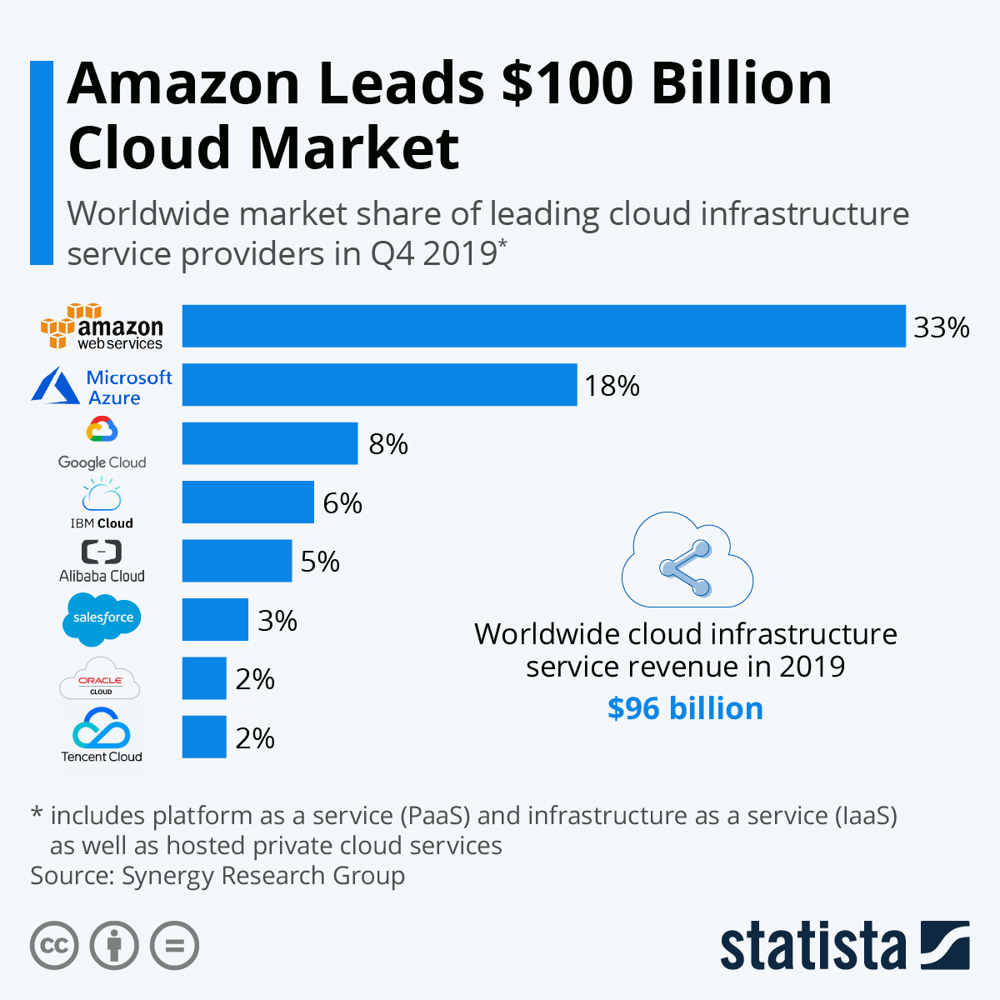

  Hi!{' '}
  
    👋
  {' '}
  This article has been turned into a talk! Check out{' '}
  
    <a
      href="https://speakerdeck.com/samjulien/where-to-start-with-aws-as-a-developer"
      target="_blank"
      rel="noopener noreferrer"
    >
      the latest version of the slides
    </a>
  
  . 
    🎉
  

AWS (Amazon Web Services) is **massive**. At the time I'm writing this, there are 175 different services on AWS! This surface area is bigger than most things you might try to learn as a developer. So where do you get started? How do you start chipping away at this complex elephant, but do it in a way that's practical?

I'm a few months in to my AWS journey and I wanted to share what concepts and resources I've found helpful so far. I resisted getting into AWS for a while because of its complexity. Any time I would log into AWS, my eyes would glaze over and my head would spin.

I realized, though, that ignoring AWS for much longer will be to my detriment. [AWS is dominating](https://www.statista.com/chart/18819/worldwide-market-share-of-leading-cloud-infrastructure-service-providers/) the hundred billion dollar cloud infrastructure and computing market:

[Source](https://www.statista.com/chart/18819/worldwide-market-share-of-leading-cloud-infrastructure-service-providers/)

Because of this, AWS certifications are in very high demand. I decided a few months ago that it's time for me to step up and at least get the [Cloud Practitioner certification](https://aws.amazon.com/certification/certified-cloud-practitioner/), and probably others like the [Solutions Architect Associate](https://aws.amazon.com/certification/certified-solutions-architect-associate/).

## Big AWS Concepts for Developers

Let's lay down a couple of definitions to help you as you progress in your AWS education.

First, what are **cloud computing** and **cloud infrastructure**? In short, this means that instead of you having to physically set up servers and networks in your garage or at your company, you "rent" these from Amazon. Everything you might want to do to run a website &mdash; the hardware that runs the server, the database, the storage that holds the frontend and static files, and the domain name configuration &mdash; can be done using AWS's networking and computing resources.

Why does this matter? The main reason is **scalability**: the ability to grow based on demand. AWS alleviates both the cost and logistics of scaling a service or business. Imagine you're running an online store for dog toys on a single server in your garage (you probably bought it on eBay). Suddenly, [Thoughts of Dog](https://twitter.com/dog_feelings) tweets about your store and your traffic spikes by twenty times as millions of people try to buy your bespoke artisan chew toys. What's going to happen? Most likely your server will crash due to that much demand. You're frantically searching eBay for another server and some networking equipment, but it will likely cost you a couple thousand bucks and several days to upgrade your server or add additional servers to your network. Ouch! (Incidentally, a show that demonstrates this dilemma perfectly is [Halt and Catch Fire](https://www.imdb.com/title/tt2543312/), which is about startups in the 80s.)

Services like AWS, Azure, and Google Cloud Platform came along and revolutionized the industry. Now instead of needing to buy a brand new server, you can click a button and immediately grow your infrastructure. Even better, you can automatically grow and shrink your infrastructure as demand for your site or service fluctuates. This helps keeps costs more predictable and spreads them out over time instead of all at once with big hardware purchases.

## Key AWS Services for Developers

When approaching AWS as a developer, there are a few of the core services that you'll likely encounter right away, so here's a quick overview of those:

- **Lambda**: Serverless functions are kind of a gateway for developers into AWS and cloud infrastructure. In AWS, Lambda is the service that runs these functions. Serverless functions let you perform calculations or access databases without having a physical server.
- **S3**: S3 stands for Simple Storage Service. This is where you host static files such as HTML, images, or videos.
- **Route 53**: Route 53 is where you set up DNS for domain names. "Route" is a reference to US Route 66 and "53" is a reference to TCP or UDP port 53, where DNS server requests are addressed.
- **EC2**: Elastic Compute Cloud (EC2) is where you run servers. If you're looking to run an API or a traditional web app using something like Node or Nest, this is what you want. EC2 costs can add up quick, so be careful experimenting with these.
- **RDS**: RDS stands for Relational Database Service so this is where you'll set up databases such as MySQL, PostgreSQL, and Microsoft SQL Server.
- **DynamoDB**: DynamoDB is Amazon's No SQL solution similar to MongoDB.
- **Amplify**: Amplify is a platform for building full stack apps quickly. The Amplify Framework consists of 3 components including libraries, UI components, and a CLI toolchain, while the Amplify Console is a static web hosting service.

These are the core services I would focus on as a developer getting started with AWS. There are many, many more services relevant to developers, but getting a handle on the basics of these will get you quite a long way.

## AWS Pitfalls for Developers

The two main pitfalls you might run into as you learn AWS (other than its sheer complexity) are **billing** and **identity and access management (IAM)**.

AWS is not free to use, though there is a free tier and some services are free. Usually these costs are minor for short periods of time, but beware: if you run through a tutorial and then forget to clean up after yourself, you might face a big bill at the end of the month! Be sure to know what costs you're incurring as you do tutorials and try to shut down and delete anything you don't need when you're finished. AWS also lets you create billing alerts that will email you when you've hit a threshold. Here's a great [egghead collection on AWS cost management](https://egghead.io/playlists/use-aws-billing-cost-management-dashboard-to-keep-your-aws-bill-to-minimum-ff0f) that will help a lot.

The other really sticky area in AWS is security. Identity and Access Management (IAM) in AWS is extremely complex. There are many layers of permissions for each service, user, and group. Most tutorials will help you navigate the basic set up that you will need to get things done. Be careful that you're not leaving yourself open to big vulnerabilities as you learn. Not only does that open the door to data theft, but it could also result in huge bills if someone gets a hold of your root account. This doc is kind of scary, but you're going to want to get familiar with [security best practices in AWS](https://docs.aws.amazon.com/IAM/latest/UserGuide/best-practices.html) little by little. At the very least, secure your root account and enable MFA.

For the sake of both billing and IAM, you will likely want to avoid using your employer's AWS account to learn. If your job is the motivation for learning AWS, work with your company on creating a sandboxed account with a given budget.

## Overview of AWS Certifications

While not all certifications in tech are created equal, AWS certifications are extremely valuable. They're designed to minimize false positives and fairly rigorous, so employers know they can use them as a solid benchmark of knowledge. This means they can add some zeroes to your paycheck and set you apart from the average developer.

There are many different AWS certifications, so let's break down what the options are.

The [Cloud Practitioner exam](https://aws.amazon.com/certification/certified-cloud-practitioner/) is considered a **Foundational** exam recommended for people with 6 months of fundamental AWS knowledge. It's high-level and not super technical, but gets your feet with AWS.

From there, there are three **Associate** level exams, recommended for people with 1 year of experience solving problems and implementing solutions using AWS. These exams have broad scope but shallow depth and break into three paths: Architect, Operations, and Developer. The three exams are:

- [Solutions Architect Associate](https://aws.amazon.com/certification/certified-solutions-architect-associate/)
- [SysOps Administrator Associate](https://aws.amazon.com/certification/certified-sysops-admin-associate/)
- [Developer Associate](https://aws.amazon.com/certification/certified-developer-associate/)

From there, there are two **Professional** certifications, recommended for people with 2 years of comprehensive experience designing, operating, and troubleshooting solutions using AWS. These exams have broader scope and are quite deep. The Architect path remains, but Developer and Operations combine into DevOps. The two exams are:

- [Solutions Architect Professional](https://aws.amazon.com/certification/certified-solutions-architect-professional/)
- [DevOps Engineer Professional](https://aws.amazon.com/certification/certified-devops-engineer-professional/)

There are also six **Specialty** exams, which are very narrow in scope but very deep:

- [Advanced Networking Specialty](https://aws.amazon.com/certification/certified-advanced-networking-specialty/)
- [Security Specialty](https://aws.amazon.com/certification/certified-security-specialty/)
- [Machine Learning Specialty](https://aws.amazon.com/certification/certified-machine-learning-specialty/)
- [Alex Skill Builder Specialty](https://aws.amazon.com/certification/certified-alexa-skill-builder-specialty/)
- [Data Analytics Specialty](https://aws.amazon.com/certification/certified-data-analytics-specialty/)
- [Database Specialty](https://aws.amazon.com/certification/certified-database-specialty/)

I decided to get some of these certifications as a way to guarantee that I will actually set aside the time to learn some AWS and have something to show for it. My plan is to get the Cloud Practicioner and then the Solutions Architect Associate. Why not the Developer Associate first? Well, my understanding is that the Solutions Architect Associate is more comphrensive than the Developer Associate, and thus it's easier to get the Developer Associate after getting the Solutions Architect Associate. It also sets you up to get the Solutions Architect Professional, which is extremely difficult and highly coveted (and thus should come with a big pay raise!). The SA-P requires the SA-A, so it makes sense to go that route. I'll update this article when I've got some results.

## AWS Resources for Developers

There are boatloads of resources for learning AWS out there. Some are geared towards infrastructure and networking folks, some are geared towards database admins, some for security teams, and others towards developers. Here are the key resources I've been using and a variety of others I've found useful.

### My Essential AWS Resources

I've found myself relying pretty heavily on these resources in my own AWS journey:

- [A Cloud Guru](https://acloud.guru/): A Cloud Guru is hands down the single best resources out there for learning AWS and just about any other cloud technology. I am honestly blown away. Just the [AWS Certification Preparation Guide](https://acloud.guru/learn/aws-certification-preparation?_ga=2.170270560.1574418745.1603210089-860129520.1602887034) is worth the cost of admission. I'm working my way through the Developer Learning Path and about halfway through the [Cloud Practitioner 2020 course](https://acloud.guru/learn/aws-certified-cloud-practitioner?_ga=2.124181706.1574418745.1603210089-860129520.1602887034). I've also used A Cloud Guru a _ton_ for work whenever I've needed to look up terms or concepts I don't understand. I had a big annoying run-in with VPCs and private networks and A Cloud Guru seriously came to my rescue.
- [Cloud Newbies Discord](https://cloudnewbies.com/): This is a Discord server founded by [Hiroko Nishimura](https://twitter.com/hirokonishimura), creator of [AWS Newbies](https://awsnewbies.com/) (which is another great site full of articles, books, and exam tips). It is immensely helpful to have a welcoming and friendly community of people with whom to learn. The server has different channels for different cloud technologies and certifications, and the community ranges from total beginners to industry experts. I can't recommend it enough!
- [Blog by Danny Steenman](https://dannys.cloud/aws-cloud-practitioner-exam-guide): [Danny Steenman](https://twitter.com/dannysteenman) is an AWS consultant and is putting out some amazing resources on AWS. I have his [complete guide to passing the Cloud Practicioner exam](https://dannys.cloud/aws-cloud-practitioner-exam-guide) bookmarked and refer back to it regularly.
- [egghead resources by Tomasz Łakomy](https://egghead.io/instructors/tomasz-lakomy): [Tomasz Łakomy](https://twitter.com/tlakomy) is a big inspiration for me to go on my own AWS journey. I've been working my way through the egghead lessons and courses he's been making on AWS (like [this course on the Cloud Development Kit](https://egghead.io/courses/build-an-app-with-the-aws-cloud-development-kit) and [this collection on the serverless application model](https://egghead.io/playlists/learn-aws-serverless-application-model-aws-sam-framework-from-scratch-baf9)).
- Since I first published this article, I've released an egghead course on [Deploying Ghost to AWS using EC2 and RDS](https://egghead.io/courses/deploy-ghost-to-aws-using-rds-and-ec2-a3487caa). It's a super practical, hands-on project to practice setting up and deploying a full stack app, including some terminal practice!

### Other Helpful AWS Resources for Devs

Here are some other very helpful resources I've found for learning AWS. I don't refer to these as regularly, but that's partially because my focus is on the Cloud Practicioner exam right now.

- [AWS Cloud Practitioner Essentials](https://www.aws.training/Details/Curriculum?id=27076): This is the official training course from AWS. It's free, but it's pretty dry and the course player isn't very sophisticated (you can't speed it up or slow it down, for instance).
- [AWS Resources](https://gist.github.com/leonardofed/bbf6459ad154ad5215d354f3825435dc): A curated list of AWS resources to prepare for the AWS Certifications by [Leonardo Federico](https://twitter.com/leonardofed).
- [What is the best resource for learning AWS?](https://simpliv.wordpress.com/2019/07/29/what-is-the-best-resource-for-learning-aws/): Somewhat click-baity but useful article compiling AWS certification prep courses.
- [The Burning Monk](https://theburningmonk.com/): Fantastic site with a bunch of resources on serverless by [Yan Cui](https://twitter.com/theburningmonk)
- [Official YouTube channel of AWS Serverless](https://www.youtube.com/c/awsserverless)
- [egghead resources by Nader Dabit](https://egghead.io/instructors/nader-dabit): [Nader Dabit](https://twitter.com/dabit3) is pretty incredible, and he has tons of great lessons and courses on egghead about things like Amplify and AppSync.
- [Full Stack Serverless by Nader Dabit](https://www.amazon.com/Full-Stack-Serverless-Application-Development/dp/1492059897): This is Nader's recent book on serverless. I haven't read it yet myself, but I mean, it's Nader, I'm sure it's amazing.
- [Awesome DynamoDB](https://github.com/alexdebrie/awesome-dynamodb/blob/master/README.md): A handy list of resources for getting up to speed on modeling, operating, and using [Amazon DynamoDB](https://aws.amazon.com/dynamodb/).
- [The DynamoDB Book](https://www.dynamodbbook.com/): Highly recommended book by [Alex DeBrie](https://twitter.com/alexbdebrie).
- [AWS Amplify Getting Started Guide](https://docs.amplify.aws/start): Great tool for getting up and running quickly with Amplify. Pick your platform and get a full stack tutorial from set up to deployment!

## Conclusion

In this article, we've talked about how to get started learning AWS as a developer. We've covered big AWS concepts, key AWS services for devs, common pitfalls, and a whole host of resources. I hope you've found it all helpful! I'm still a newbie (hooray for learning in public!), so [reach out to me on Twitter](https://twitter.com/samjulien) if I've missed your favorite resource or if you've found anything particularly useful.

If you're trying to level up your developer career through writing and speaking or hoping to become a developer advocate, hop on my email newsletter below and check out my books [Getting Started in Developer Relations](http://www.gettingstartedindevrel.com) and [Guide to Tiny Experiments: A Simple Framework to Finish What You Start](https://learn.samjulien.com/guide-to-tiny-experiments).

See you next time!
