In September 2020, I joined a Two Week Product Challenge led by [Joe Previtte](https://twitter.com/jsjoeio) and inspired by [Daniel Vassallo](https://twitter.com/dvassallo/status/1287210142459547648).

During that time I wrote and published my first ebook called [Getting Started in Developer Relations](http://www.gettingstartedindevrel.com). I wanted to share the process I used as well as what I learned, what worked, and what didn't.

## Writing the Book

Even though I wrote the book in two weeks, I already had a lot of the content for it either written down, published as articles, or in my head. Running [Auth0 Ambassadors](https://auth0.com/ambassador-program), I am constantly thinking about teaching others how to do developer relations. This book gave me an excuse to formalize everything I had been thinking about. While I wasn't totally starting from scratch with the content, I _was_ starting from scratch with the _product_. I found the process of forcing myself to package up and sell content really transformative. It gave me a reason to be succinct and a format I could use to get my thoughts out into the world.

For the writing itself, I used [Drafts](https://getdrafts.com/) as a scratch pad to jot things down and then Notion to plan out the content. I also used [Notion](https://notion.so) to compile all of the links and resources I would include. Notion makes it really easy to drag around blocks of content and create databases that you can refer back to.

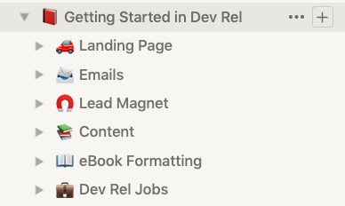

Once I was ready, I wrote the book in Markdown in an app called [Ulysses](https://ulysses.app/). Ulysses turned out to be a great platform for writing and for generating the final PDF. It also has a custom styling format (basically "CSS lite") that let me shape the book how I wanted without too much hassle.

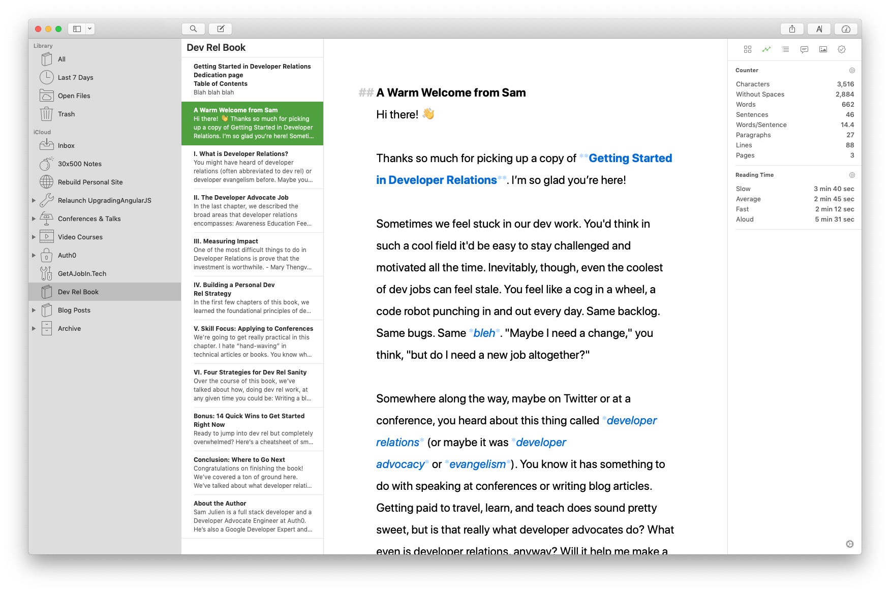

The major downside of Ulysses is that it doesn't support table of contents generation, covers, or footnotes. I had to manually stitch together Ulysses' output with the cover and a TOC I made in Pages. This makes the book very difficult to maintain, especially because the page numbers are dependent on how Ulysses outputs the book.

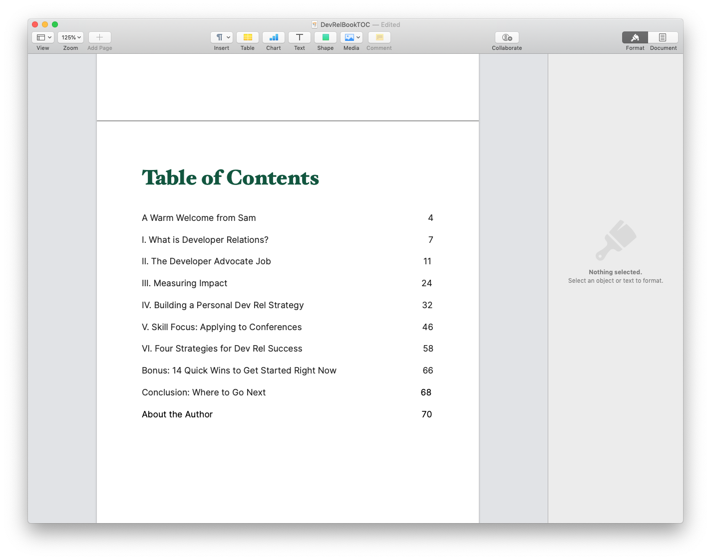

Probably the biggest technical lesson I learned in this process is that book formats are _way_ harder than I expected. Ulysses was amazing for generating the PDF, but it didn't translate to ePub or mobi (technically it can export to ePub but it looked awful). I hired someone on Fiverr to try to convert to the different formats and it was all still a mess. In the future I need to write the book in a format that can easily output all of the different formats. I'm looking at [Bookdown](https://bookdown.org/yihui/bookdown/).

One thing that worked well was [the book resource page](https://www.samjulien.com/devrel-book-links). Rather than have an appendix of resources at the end of the book, I created a page on my site that I linked to at the end of each chapter. That way I don't have to release a new version of the book every time I want to tell readers about a new resource.

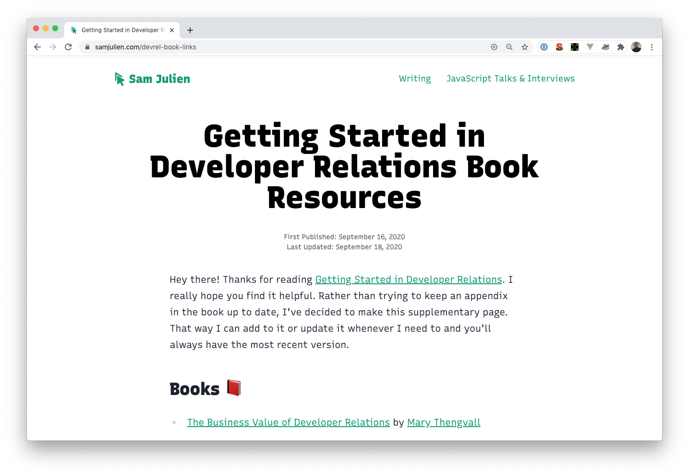

I'm not much of a designer, so I hired [a designer on Fiverr](https://www.fiverr.com/nskvsky/do-book-cover-design-book-cover) do the cover. It took a little while to hammer out what we wanted the look and feel to be, but it was well worth it. It cost me about a hundred bucks to get this cover, but that's only because I misunderstood something and had to pay for an additional revision. Even so, it was well worth it. I did have the branding for my site to plan around, so that helped with some of the font and color choices. I tried to use the fonts for this web site in the book (Recursive and Inter), but I was having problems with using variable fonts in Ulysses.

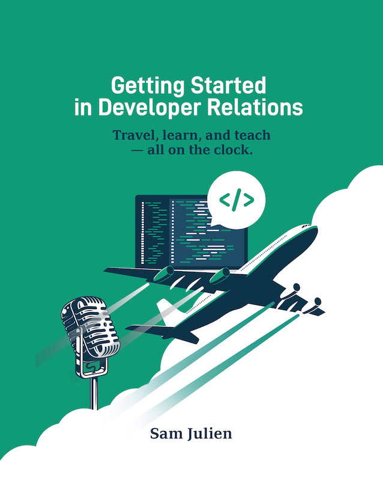

## Selling the Book

I used [Podia](https://podia.com/) to sell the book as a digital download rather than just emailing the PDF out to people. This gives me flexibility to upload new versions or add any additional formats or downloads and immediately give all customers access. Podia also lets you do a "pre-launch" status where you can collect email addresses. I set this up with ConvertKit so I could document the launch (more on that in a sec).

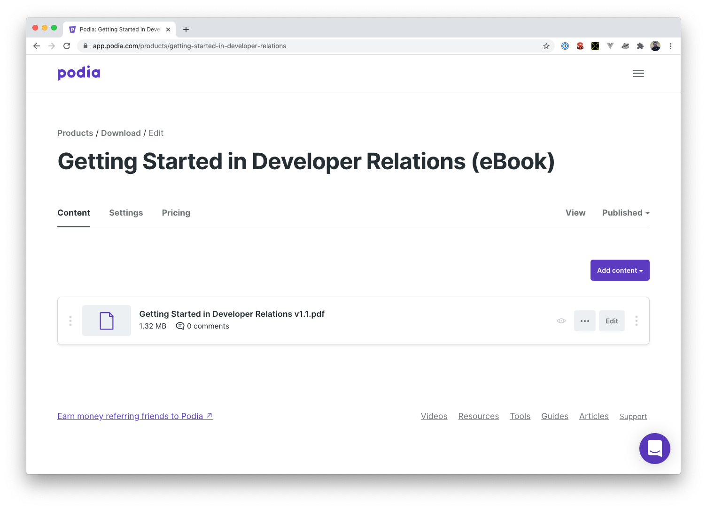

I priced the book at $9. I wanted to make it easy to purchase and easy to discount, a no-brainer. That price point seems to be right. I was originally going to boost the price to $19, but I've decided to do that if I do a revised and expanded second edition.

I bought a custom domain ([gettingstartedindevrel.com](http://www.gettingstartedindevrel.com)) and pointed it to the landing page for Podia instead of writing a custom page. I might replace that landing page at some point, but it wasn't critical to get it shipped.

One of the biggest issues I ran into was on launch day. My previous upgrade course used to be on a custom platform that used the Stripe API, so I had a bunch of ConvertKit automations based around Stripe purchases. It turns out that Stripe doesn't differentiate between products, so a bunch of people got random emails about ngUpgrade before I could catch on and restructure my email list.

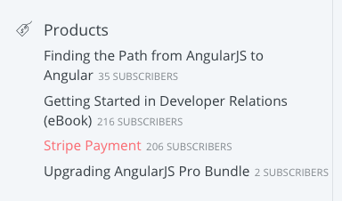

Another thing that's less than ideal is that team purchases are a manual process. I basically have to create an invoice on PayPal, then have the customer send me a list of email addresses to manually enroll. This makes those customers appear to be "free" customers, which means group purchases don't get included in Podia's revenue calculation.

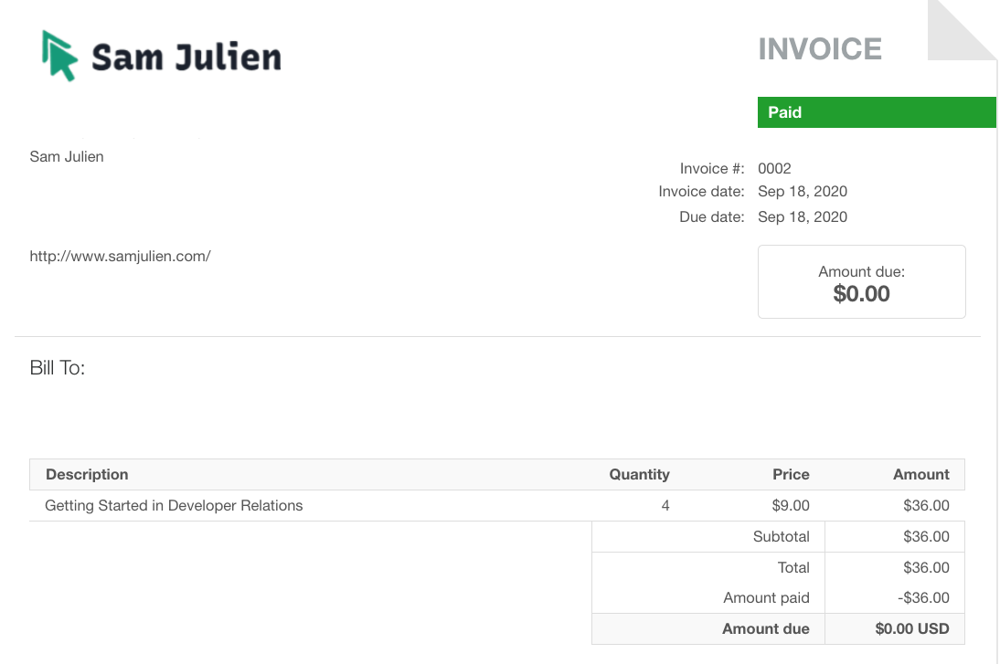

## Marketing the Book

I did all of the marketing for this book through my email list on [ConvertKit](https://convertkit.com/) and Twitter.

Since Podia allowed for pre-launch email sign-ups, I sent a handful of updates through ConvertKit as broadcasts (ConvertKit's name for one-off emails). I then sent one email blast on launch day to my entire list. At the time that was 236 people and it had a 53.4% open rate and 18.6% click rate.

The book has definitely driven a lot of growth in my email list on ConvertKit, as now I'm hovering right around 700.

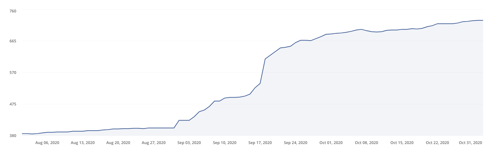

I have an automation set up to put customers through a welcome sequence, which then transfers them to my main email list. There are opt-out links for each sequence as well as unsubscribe links.

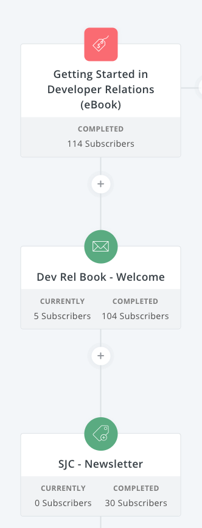

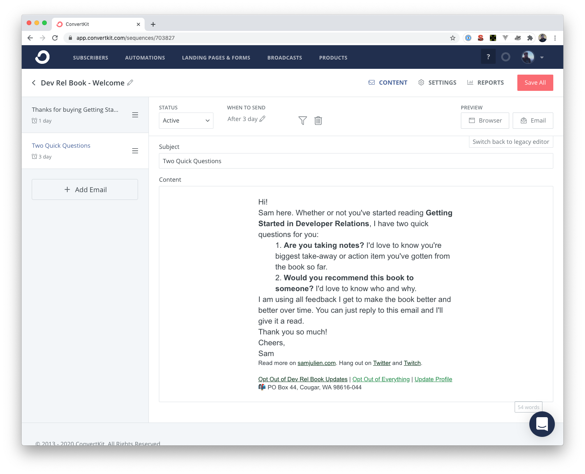

The integration between ConvertKit and Podia isn't quite perfect. Sometimes the lists don't sync properly, and if someone was already on the list and purchases, they don't get necessarily get updated with that status.

I got a much bigger reaction than I expected when the book launched. I was expecting a handful of sales over a few days but broke 100 within 24 hours. This tells me I struck a chord with people looking to get into dev rel, which is super encouraging.

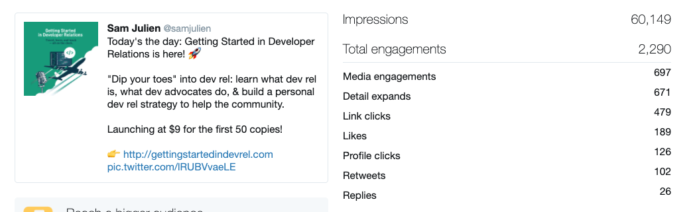

## Top Takeaways

Overall, this was a great "stress test" of my content planning, creation, & marketing systems. I learned about where my weak spots are and where I'm doing a good job. The writing part was easy for me because it's a subject I'm so passionate about, but the logistics were tough!

The main thing I would change for next time would be to use a better tool for writing the book that supports a table of contents, multiple eBook formats, and version control. I'm looking at [Bookdown](https://bookdown.org/) for this. I would also put more time ahead of time into the email sequences, both for the launch and for folks who purchased the book.
