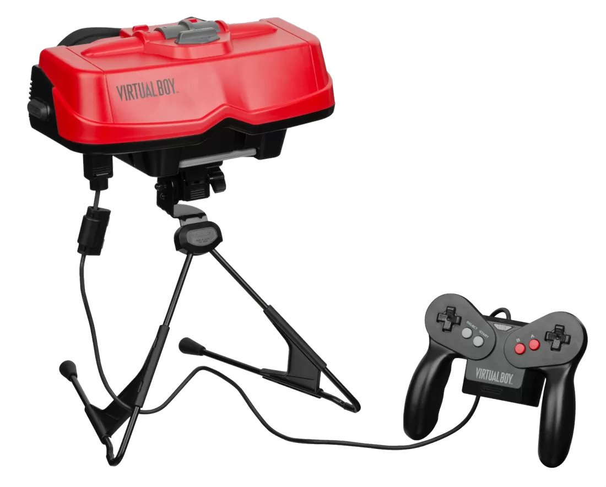

Tell me you've done this before:

1. Get an amazing idea
2. Buy a sweet new domain
3. Tweet about your awesome new project
4. `git init`
5. Um...uh...do some planning?
6. You know what, I'm really busy right now.
7. I really need to work on that...
8. (Secretly abandons dreams)

Why do we do this!?

The simple answer is of course that having ideas is _way more fun_ than seeing them through. That would be adequate if it wasn't _so discouraging_ to repeat this cycle all the time. It starts to creep from "I have a bunch of unfinished projects" to "I'm just not the kind of person who finishes things" and that can be really disheartening.

In this article, we're going to talk about finishing what you start. We'll talk about:

- Mindsets that block us
- Slimming down your project list
- How to move more to the done column (hint: it's not "work harder")

Let's dig in!

### Mindsets Blocking Us from Finishing Projects

Like most behaviors, un-finishing (a word I just made up) stems from our beliefs about ourselves. Here are three that I've wrestled with over time:

- **Fear of failure:** I'll never succeed. I'm not good enough.
- **Fear of success:** What happens if this takes off? What if I get 1 million requests per second and I didn't plan for that? What if people call me a phony?
- **Perfectionism:** I have to make this perfect before anyone ever sees it.

Any of those resonate with you? These three have definitely kept me from hitting the publish button or starting to build out an idea I had.

What do we do about this? I could sit here and give you logical arguments as to why each of these mindsets is wrong. The problem is that we're _not logical_ with ourselves when we feel these things. I'm never able to out-argue my emotions. My brain can rationalize any left-field self-loathing that comes my way if I'm in the wrong headspace.

What helps overcome all of these mindsets is **action**, which translates into **experience**.

- If you start getting some wins under your belt, you'll feel less like a failure.
- If you do rocket to success, you'll learn how to handle it and how to ask for help from people who've been there. (And if someone calls you a phony, you'll deal with it and move on with your life.)
- If you start shipping things a little bit earlier than you feel comfortable, you'll start realizing that you are your harshest critic -- and end up helping a lot more people than you realize.

We believe a lot of stories about ourselves that we've told and re-told a million times. Some of them are accurate, but most of them aren't. Arguing with the story doesn't work very well, but living out a different one will change the way you see yourself.

To that end, let's dig into the practical and help you rack up some wins.

### Ideas vs. Projects

The first step to finishing more of what you start is reducing your idea backlog. Repeat after me:

**Not every idea you have needs to be executed.**

Put another way: _Not every idea needs to become a project._

Some ideas are good, some...aren't. What you need is a good way to capture these ideas and decide which ones are worth working on and which aren't.

You can get really sophisticated with this and build a system around it, but for now, why don't you just open a text editor and write out a list of every unfinished idea or project you have? (Or just set a timer for 15 minutes if you're a modern DaVinci.)

### Triaging Ideas

Do you have your list of ideas and projects? Great. Now you need to process them. For each project, you're going to give it one of three outcomes:

1. **Drop it:** It seemed like a good idea at the time, but it's just not, like the [Nintendo Virtual Boy](https://www.youtube.com/watch?v=Jjz4bls_gPs). Just let these go.
2. **Defer it:** Possibly a good idea, but you don't have the time or resources to work on it right now. Put these in an Ideas Archive with your notes, links, and your most recent thoughts about the project (e.g. "I don't know enough about the Go ecosystem yet to know if this is worth doing."). Your Ideas Archive could be in text or Markdown files or an app like [Notion](http://notion.so), [Obsidian](https://obsidian.md/), or [Evernote](https://evernote.com/). Don't overthink it; just get started.
3. **Do it:** A good idea that also has the potential to either be profitable, build an audience, help a lot of people, or take you to the next level of your career.

Try to narrow that big initial list down to just a handful of viable ideas. You're looking for the ones that you have the time and resources to work on right now. Not all at once, just at all; if you were to pick one, it might feel a little overwhelming but not impossible.

[[Source](https://www.techspot.com/article/1085-nintendo-virtual-boy/)]

(Okay, in truth I actually kind of liked the Virtual Boy, but I think it was because as a 10-year-old kid it seemed futuristic and cool. How was I supposed to know it was a flop?)

### JPS: Just Pick Something

Okay, so let's say you've got a clean list of 3-5 solid ideas. They seem equally valuable with regard to profit, career growth, fun, or impact. How do you pick?

The best thing to do here is the JPS strategy: Just Pick Something. Throw a dart at the list, randomly generate a number, or play pin-the-tail-on-the-idea. Just pick something. Why? A few different things might happen when you pick something and start working on it:

1. **You might start working on it and kinda hate it.** Hate might be too strong. Maybe you just get bored of it or it just doesn't "spark joy" like you thought it would. That's some helpful data. Just drop or defer the idea and move to the next one. Now you know!
2. **You might use it as a training ground to learn a bunch of skills.** Sometimes a project isn't a dud, but it's also not a huge success. That's okay too. Getting practice setting up an app or landing page, building an email list, writing, or making architecture decisions are intrinsically valuable, regardless of the topic. Even if your original idea never takes off, you're still better off for trying.
3. **You might come to love the project and use it as a springboard for other ideas.** I didn't make my ngUpgrade course out of a passion for large scale refactoring. 😅 I made it because it was a way I could help other people escape some of the pain and suffering I went through. But a funny thing happened: I _became_ passionate about that work. Suddenly people were coming up to me at conferences thanking me for saving them a bunch of time and headache. I started bonding with students and became emotionally invested in their success. This led to other opportunities like consulting and speaking (including a life-changing trip to Finland). All of that came from picking an idea in front of me that had good potential and following through with it as best I could.

You may be thinking, "But Sam, if I pick something that I end up disliking or fails, didn't I just waste a bunch of time?" That depends on how you big you make the project.

### Tiny Experiments: Reducing Your Scope

Now that you've picked something, it's time to reduce its scope so you can actually ship something into the world. Take the dream and scale it way down to a Minimum Viable Product. This works equally well for content and dev projects, by the way. A few examples:

Dream: A global AirBnB for dogs
MVP: Basic website, forum (Discourse), and payment system (Stripe)

Dream: Ultimate guide to full stack TypeScript apps
MVP: A single article on setting up Express with TypeScript

Dream: Learn Golang
MVP: Build and deploy first tiny app

So there you have it: the secret to getting more done is lowering your standards. 😅 No, no, there's a reason for this. Scoping down projects is all about _validation_. Remember when I mentioned risk? Let's talk about that.

### Validating an Idea

Your goal with a new project isn't to get 100k users, make a million dollars, or change the planet. Your goal is to validate your idea with a few people. This might mean comments on some content, a kind message from someone, or a few people (who aren't related to you) buying a product or service you put out.

You're looking for quality over quantity here, because if something resonates with or helps a few people, it will likely scale to bigger numbers as you put more effort into creating and promoting the project.

Validating an idea saves you _a lot_ of time in the long run. Imagine secretly building a massive project or piece of content only to have it flop. This happens a lot and it's very hard to learn from these. Was it the topic? The format? The way you marketed it? The platform you used?

Validating tiny experiments lets you get feedback and improve. If your tiny experiment gets zero traction, you could tweak a few things and try again or you could drop or defer it.

### Improving What's There

Once the idea is validated, you can take the next steps: build the next feature, write the next article, or update and improve to release the next version. As you continue to build a body of work in an area, the results will compound. You'll be able to cross-reference material you've created, build a network of people who are interested in the same topic, and establish yourself as a credible source and helpful community member.

I used this same "validate and iterate" process to write [Getting Started in Developer Relations](http://www.gettingstartedindevrel.com). I had a hunch that a book like that would get a good response. Rather than agonize over every decision to create a perfect book, I time-boxed the initial production to 2 weeks. Granted, I have a lot of writing and product experience at this point, so I wasn't totally starting from scratch, but I was able to get something I was proud of out into the world and see what kind of response it would get. To my delight, it's been a great response!

Now that I know the idea is valid, I am working on a revised and expanded version that incorporates feedback I've gotten from readers.

You could also choose to abandon a successful experiment. Maybe you got what you wanted out of it or it wasn't as fulfilling as you thought it would be. Either way, you gave it a shot, created something, and grew.

### How to Go Deeper

This "tiny experiment" framework is helpful everywhere, not just with dev or content. I've used it for everything from nutrition to home improvement projects.

If you're curious where this kind of thing comes from, there are a few answers, but one I'll leave you with is called [construal level theory](https://en.wikipedia.org/wiki/Construal_level_theory) in social psychology. This is basically saying (as I understand it) that the farther away something is (whether physically, psychologically, chronologically, or otherwise), the more abstract it appears. This is why we don't plan for retirement soon enough. It's also why "start a 1 million user SaaS" isn't a great project; if you've never done that before, you have no idea what the steps are to get there. It feels abstract and complex so you'll likely abandon it. Here's [a great article on that subject](https://medium.com/@Jude.M/read-this-if-you-struggle-with-finishing-things-you-start-a0fdaa83aa6a) by a research scientist named Jude King.

Try this framework out and see if it works for you. I've used it in all kinds of areas of my life, not just developer or dev rel projects. As always, I'd love to hear if it's helpful for you and how you've added your own spin to it!

_This article began its life as an issue of the **Developer Microskills Newsletter**. Each week, I send out a practical, actionable way to improve as a developer and developer advocate. Sign up below!_
