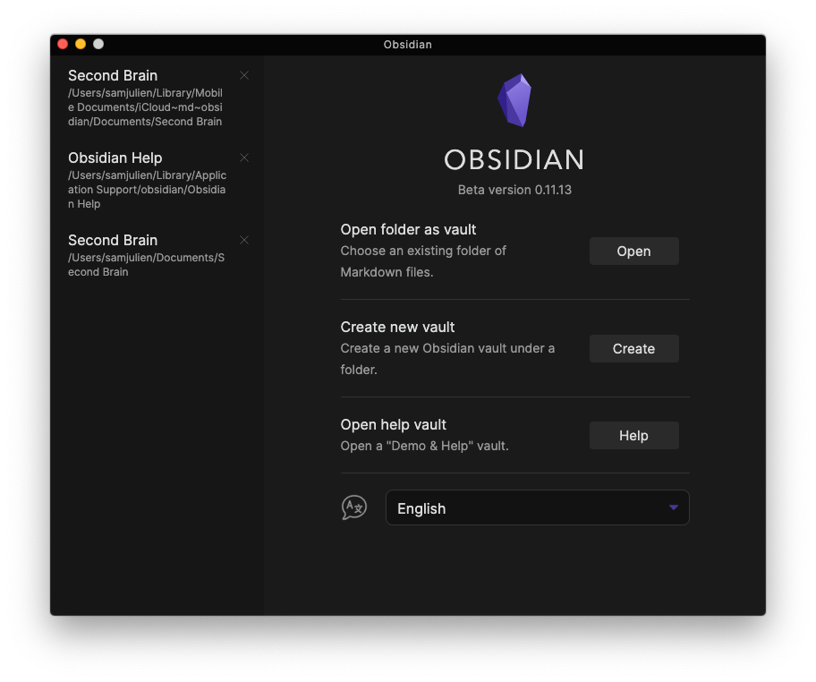
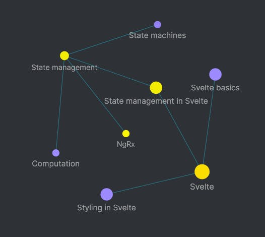

Do you ever feel like you have the same ideas repeatedly but don't know where to collect them to turn them into something real? Do you find yourself regularly trying to remember that article someone sent you or that tool you discovered? When you're working on projects for work or creative projects, do you have a hard time gathering together all of the context and resources you need?

The notes application [Obsidian](https://obsidian.md/) has solved all of these problems and more for me. I use Obsidian to:

- Visualize connections between ideas
- Build a personal knowledge wiki (including a self-care handbook)
- Collect notes and resources on a topic I'm learning or writing about
- Keep track of notes and resources for standing meetings and projects

## What is Obsidian?

Obsidian is a _personal knowledge management_ (known as PKM) app available for Mac, Windows, and Linux (mobile apps are in private beta right now). These apps have been cropping up a lot more frequently. You may have heard of [Roam](https://roamresearch.com/) or [Notion](https://www.notion.so/), but there are others like [The Archive](https://zettelkasten.de/the-archive/) (which has been around a long time) and [Craft](https://www.craft.do/). PKM is the next evolution in how we use computers to think and process information as humans. The magic of these apps lies in the _backlink_, a way to link together notes or sections of notes. In Obsidian, this is done with two square brackets: [[this is a backlink]].

This may not sound like a big deal, but it's incredibly powerful. Let's say you're learning about the web framework Svelte. Not only could you link together notes on styling, state management, and routing in Svelte, you could link to more general notes on any of these topics. Your notes about state management in Svelte could link to notes about state management in Angular or React, state machines, or even just general computation notes. Course notes from a particular instructor could also link to each other.

Even better, apps like Obsidian also allow you to visualize those connections through graphs. Here's how that Svelte example would look as a graph in Obsidian:

Backlinks and visualization are extremely powerful as they spark more connections between ideas, cement our understanding of what we’re learning, and inspire content creation. Harnessing this power can honestly be life-changing, as bold of a claim as that sounds. Not only has my PKM system saved me a lot of time, it's also enabled me to perform at a higher level, create deeper connections between ideas, and keep better track of progress on projects of all kinds.

You could take the same approach for projects or apps you're working on. Suddenly you can compile together links and tools related to your side project while also linking to lessons you've learned from previous apps, notes from books you've read, or meeting notes. I draw a lot of inspiration from non-technical subjects like weight training, mindfulness, music, and strategy games, so the ability to link technical ideas to non-technical concepts is especially useful to me.

Why does this matter? Whenever we're learning a new area, we're slowly putting together puzzle pieces. At some point, a lightbulb will go on where we have a blend of knowledge and experience that shows us a clearer map. Your brain gets to that point by making connections between things, and often unrelated ideas will lead to those epiphanies (like those experiences where yard work or something a family member says helps you solve a problem). Apps like Obsidian and Roam let us accelerate that process by giving us a "second brain" that will store those connections when we're not currently thinking about a subject. They also provide tools to make that note-making and linking process easier than just jotting things down in a text editor.

It's a game-changer.

## Why Obsidian?

So why do I use Obsidian and not something else? There are several reasons:

- Obsidian uses local Markdown files, so, unlike some cloud based apps, there's no proprietary format to worry about if Obsidian suddenly stops being developed.
- They have a paid option for end-to-end encryption.
- Local files can use version control like git or be synced to a cloud service (Obsidian also offers a paid sync service).
- Obsidian is simple and fast but extensible through a vast plugin ecosystem. There are all kinds of plugins: calendars, kanban boards, plugins to regularly re-surface notes for learning, and even a data system that lets you query metadata and build graphs.

Possibly the biggest reason I love Obsidian though is that it feels like an IDE for thinking. Many apps are too slow and clunky in their UI. They add too much fluff or have too much of an opinion about how I store data. Why do we love VS Code so much? It gives us just enough support while getting out of our way. VS Code doesn't prescribe how to architect apps. Obsidian doesn't prescribe how to structure knowledge. At the same time, more "spartan" apps tend to go too far and neglect UX. Obsidian still has nice touches like custom keyboard shortcuts, panes you can move and split, dynamic link updating (when you change a file name the links update automatically), and even the CMD-P command palette VS Code has hardwired into my brain.

There's a very good reason why I feel like Obsidian is an IDE for my brain. Check out this section of Obsidian's [about page](https://obsidian.md/about):

> Although we call it a personal knowledge base or your 'second brain', we also like to think of it as an IDE for your notes. You can think of an IDE as a powerful frontend that tries to understand your code, such as where are functions and variables stored, what are their types, and by doing so make it super easy to navigate code and get suggestions as you type. In this sense, with most of the current note-taking apps, working with notes feels like writing code without syntax highlighting, code autocomplete or Git integration. All the things that programmers have been taken for granted for decades. That's pretty sad, don't you think? Today's knowledge workers are facing new challenges all the time, and they deserve better tools.

This makes perfect sense when you think about it, because Obsidian is made by Shida Li and Erica Xu, two software engineering grads from the University of Waterloo. I love all of the developer-friendly touches Shida and Erica put into Obsidian, and you can see how quickly they are working by periodically checking out the [development roadmap](https://trello.com/b/Psqfqp7I/obsidian-roadmap) Trello board!

Wrangling all of my notes is a problem I've been trying to solve for years. I've always been a journaler and note-taker. I've written in text documents, Google Docs, Bear, Ulysses, Notepad++, and who knows where else. Writing apps like Bear and Ulysses don't have the linking structure I need, but text documents don't either. Google Docs can kinda sorta link together but there's no way to see how they all tie together.

My introduction to knowledge management was through [Joel Hooks' recommendation of Tiago Forte](https://joelhooks.com/basb), which led me to discover Notion. While I still use Notion for running this newsletter and tracking projects (a la Kanban board), I found it was way too slow to use for knowledge management. Everything you type into Notion gets processed because of the way its command system works (for example, typing @ or / triggers command menus to pop up); it's always trying to guess what you're trying to do. This adds a lot of overhead to writing time. I've also experienced several outages with Notion, which inspires a lot of fear that my entire knowledge base will suddenly be unavailable with no offline mode. Notion promises things are going to get better, but I just can't keep waiting for this mission critical stuff.

I will caveat that I haven't tried Roam. A huge reason for this is that, last I checked, Roam doesn't even have two factor authentication and has no plans for end-to-end encryption. That's a dealbreaker for me. It's not like I'm doing anything top secret, but my notes are an evolving and private reflection of my thoughts. I don't really want those on the cloud behind minimal security.

## Obsidian Pricing

Obsidian has a simple [pricing structure](https://obsidian.md/pricing). Believe it or not, Obsidian is free for personal use. If you'd like to support development, you can purchase a Catalyst license. Catalyst is a one-time payment with a few different tiers. It gets you access to insider builds and a dev channel in the Discord. I also pay for a business use license since it's become so indispensible to my creative process for my newsletter, books, and videos.

There are also two add-ons you can purchase:

- [Publish](https://obsidian.md/publish) for $8/month, which lets you create a publicly available website using your notes.
- [Sync](https://obsidian.md/sync) with encryption for $4/month. Obsidian Sync comes with 1 year of version history.

## Obsidian Themes

Just like VS Code, Obsidian lets you customize the look and feel of the app with themes. Here are a few of the most popular:

- [Minimal](https://forum.obsidian.md/t/minimal-theme/3659) by [Stephan Ango](https://twitter.com/kepano) is an opinionated Obsidian theme and plugin designed to create the most natural and distraction-free environment for thinking.
- [Blue Topaz](https://forum.obsidian.md/t/theme-blue-topaz-v1-7-updated-20201209-for-v0-9-22/6425) by WhyI is a nice, pleasing blue theme
- [Obsidianite](https://forum.obsidian.md/t/obsidianite-theme-version-1-1-1-nov-17-2020/7876) by [Benny Guo](https://twitter.com/tridiamond6) is focused on generating the feel of Obsidian in the galaxy. I love the vaporwave look!
- [Erik](https://github.com/fools-mate) has ported over [Sarah Drasner](https://twitter.com/sarah_edo)'s beautiful [Night Owl theme](https://forum.obsidian.md/t/theme-night-owl/9001).
- [Cybertron:](https://github.com/nickmilo/Cybertron) is a revised retro theme by Nick Milo inspired by Cyberpunk 2077, Dynalist, Tron, and more. This is the theme I currenly use.

## Obsidian Plugins

Obsidian has a fantastic plugin architecture that divides into core plugins and third-party plugins.

### Core plugins

Core features of the app like [backlinks](https://help.obsidian.md/Plugins/Backlinks) and the [graph view](https://help.obsidian.md/Plugins/Graph+view) are actually just plugins that can be enabled or disabled. Here are some core plugins you might want to check out that are off by default:

- [Audio recorder](https://help.obsidian.md/Plugins/Audio+recorder) lets you make a recording without leaving Obsidian.
- [Templates](https://help.obsidian.md/Plugins/Templates) lets you quickly insert snippets of text into your current note.
- [Daily notes](https://help.obsidian.md/Plugins/Daily+notes) will create a new note that is automatically named with the current date.
- [Starred notes](https://help.obsidian.md/Plugins/Starred+notes) will create a star icon on the left panel, which brings up a list of starred notes.
- [Slides](https://help.obsidian.md/Plugins/Slides) lets you do simple presentations right inside Obsidian.

Combining plugins like daily notes and templates with custom keyboard shortcuts can really take your knowledge management game to the next level.

### Third-Party Plugins

There's also an entire ecosystem of [third-party plugins](https://help.obsidian.md/Advanced+topics/Third-party+plugins). To enable third-party plugins, you first need to disable Safe Mode in settings. After disabling Safe Mode, you can find third-party plugins in Settings -> Third-party plugin -> Community plugins -> Browse. You can browse plugins by popularity, search for specific plugins, and install them with a click.

Remember: treat these plugins the same way you treat npm packages (vet using popularity and be safe about source code!).

Here are some of my favorite plugins from the community:

- [Editor Syntax Highlight](https://github.com/deathau/cm-editor-syntax-highlight-obsidian) by [Gordon Pedersen](https://twitter.com/death_au) lets you see syntax highlighting while editing (you can already see syntax highlighting when you preview).
- [Sliding Panes](https://forum.obsidian.md/t/sliding-panes-andy-matushcak-mode-plugin/7652), also by Gordon Pedersen, changes the way panes in the main workspace are handled. Instead of shrinking the workspace to fit panels, the panels will remain a fixed width (but resizable) and stack so you can scroll between them.
- [Calendar](https://github.com/liamcain/obsidian-calendar-plugin) by Liam Cain creates a simple Calendar view for visualizing and navigating between your daily notes.
- [Obsidian Git](https://forum.obsidian.md/t/obsidian-git-plugin-for-automatic-vault-backup-with-git/7790) by Denis Olehov will automatically backup your vault into git.
- [Obsidian Tracker Plugin](https://github.com/pyrochlore/obsidian-tracker) by pyrochlore helps you track tags and texts in daily notes.

The coolest part is that, since Obsidian is just an Electron app, so you could write your own plugins in JavaScript! To get started, check out the [sample plugin](https://github.com/obsidianmd/obsidian-sample-plugin) and read through the [Obsidian API](https://github.com/obsidianmd/obsidian-api).

## Further Down the Rabbit Hole: Using Other Tools with Obsidian

One thing I love about Obsidian is that, because the vault is just a bunch of markdown files, many other tools work well with it. For example:

- You can export book highlights from [Readwise](https://readwise.io/) as markdown and import them into Obsidian automatically through the [official Readwise plugin](https://github.com/readwiseio/obsidian-readwise).
- Each note has an Obsidian URL you can copy and use anywhere. To get it, you can right-click on a note or find "Copy Obsidian URL" in the command palette (to which you could also attach a keyboard shortcut). This makes it incredibly easy to reference and link to specific notes in external applications like Google Docs or your task manager. You could even use [Keyboard Maestro](https://www.keyboardmaestro.com/main/) to set up a keyboard shortcut to navigate to a certain note, like a note that acts as a project knowledge hub.
- I still use [Drafts](https://getdrafts.com/) as my starting point for ideas and articles (I'm writing this issue in Drafts right now), but since Drafts also uses Markdown, I can just copy anything I need over into Obsidian and add backlinks and tags. At first I was frustrated by this extra step and wanted to compose directly in Obsidian, by I've discovered this is actually a good process. Drafts lets me get out of my own way to jot something down, but then I can go back later to decide whether that piece of text is something I want to move into my knowledge library. While it's tempting to dump everything in Obsidian, I really want to let it naturally evolve so that everything in it is useful.

## How I'm Using Obsidian

I use PKM broadly and Obsidian specifically for a few different purposes:

- Mapping out ideas in my brain (this newsletter and my book [Guide to Tiny Experiments](https://learn.samjulien.com/guide-to-tiny-experiments) are direct results of that process)
- Making notes on what I'm learning and reading
- Centralizing research, resources, and links on a topic or project (this is amazingly useful beyond day job work too &dash; I keep track of house and self-care projects, too)
- Documenting my systems and processes

I've found Obsidian to be the perfect place for "medium to long term" notes and ideas. I still use [Drafts](https://getdrafts.com/) as my "idea inbox" because it's so fast and so low friction that I can quickly write or dictate something and then immediately get back to work. For example, I often have moments of clarity about personal growth while I'm working out or doing dishes, activities that let my brain decompress. I can use my watch to dictate something into Drafts, then the next day move it into the appropriate note in Obsidian (or trash it if it's not that good of an idea). What's awesome about this is that, instead of constantly having the same epiphanies, I can capture those moments and then add them to a growing body of work. It's the epitome of "slow burn" instead of "heavy lift."

This is a problem I've been trying to solve for years. I've always been a journaler and note-taker. I've written in text documents, Google Docs, Bear, Ulysses, Notepad++, and who knows where else. Writing apps like Bear and Ulysses don't have the linking structure I need, but text documents don't either. Google Docs can kinda sorta link together but there's no way to see how they all tie together.

## Mistakes I've Made with Obsidian

I know I've got you chomping at the bit to try Obsidian, but I want to tell you about two critical mistakes I made when I was getting started with PKM and Obsidian that lost me a lot of time.

The first mistake I made initially was dumping too much information into Obsidian -- attempting to archive every note, article, highlight, or link I could find. I was like The Collector from Guardians of the Galaxy. This added way too much junk and noise to my Vault. My advice would be: don't treat Obsidian like you'd treat Pocket or Instapaper. Obsidian is most useful when it's a reflection of what's important to you and your own original thoughts, feelings, and notes on what your learning and reading. Think of your Obsidian vault as self-documentation, building a conversation partner that you can think through problems with and that helps you remember things.

The second mistake I made was adding too much structure too quickly. I migrated a bunch of information from Notion and other places and quickly added a bunch of folders and structure. This was a mistake. In learning from others and gaining experience, I reverted to a simpler approach: letting the backlinks and graph cause the structure to emerge organically. This means being okay for a while with a bunch of notes in a list. The point of this process isn't to categorize a bunch of files, it's to use backlinks and the quick launcher (cmd-O) to organically navigate the way your brain connects ideas. Eventually some structure did emerge, but it was specific to the way I use Obsidian. Allow yourself to build your own system over time.

## More Obsidian Resources

I'll leave you with a few more resources to help you in your Obsidian journey:

- The [Obsidian Community](https://obsidian.md/community) consists of the forum and Discord server. Join to get to know the community and get answers to questions!
- [Ben Hong](https://twitter.com/bencodezen) has this nice [Obsidian boilerplate kit](https://github.com/bencodezen/bens-obsidian-boilerplate) to provide people some inspiration and ideas for their own workflows.
- [Linking Your Thinking](https://www.youtube.com/channel/UC85D7ERwhke7wVqskV_DZUA/featured) is Nick Milo's incredible YouTube channel with tutorials on Obsidian. He also has an amazing cohort-based paid workshop he runs periodically.
- [Bryan Jenks](https://www.youtube.com/channel/UCfhSB16X9MXhzSFe_H7XbHg) also has an awesome YouTube channel with some helpful Obsidian content.
- [David Sparks' mentions of Obsidian](https://www.macsparky.com/blog/tag/obsidian#show-archive) are helpful for seeing how Obsidian compares to other PKM apps.
- The [Obsidian 2020 Story of the Year nomination thread](https://forum.obsidian.md/t/obsidian-story-of-the-year-2020-nomination-thread/9366/) contains lots of helpful examples of how Obsidian is helping people do better work.
- [Obsidian Roundup](https://obsidianroundup.org/) is a weekly roundup of Obsidian.md tips, news and resources via [Eleanor Konik](https://twitter.com/EleanorKonik).

I hope this was helpful and that you enjoy using Obsidian as much as I do!
