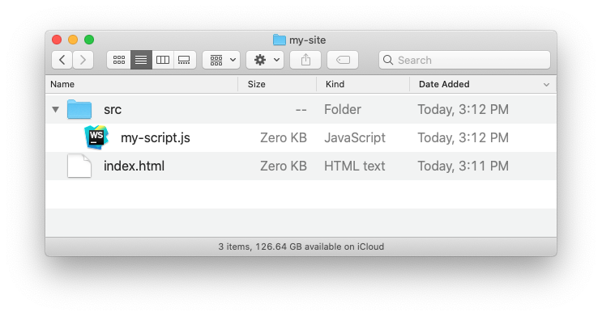

Hey there! You likely got here because you're building a web page and need to know how to include JavaScript in it. You may also be a new web developer who needs to include a JavaScript library or framework in your application. Have no fear! In this article, I'll show you the two ways to include JavaScript in your HTML files.

## Including JavaScript in your HTML

There are two ways to link JavaScript to HTML:

- You can write it directly into your HTML using a special tag, or
- You can link to it as an external file

The most common way is the latter, using JavaScript in an external file, but I'll show you both ways.

### Including JavaScript with the Script Tag

You can use the `<script>` tag to write JavaScript right inside of your HTML file. The `<script>` tag is very similar to the `<link>` tag used to include your CSS files.

Here's an example of using JavaScript directly inside your HTML. It will log to the console as soon as the page loads.

```html
<!-- index.html -->
<script type="text/javascript">
  console.log('Hello world!')
</script>
```

Don't forget to use the attribute `type="text/javascript"` when using the script tag.

### Including External JavaScript with the Script Tag

The `<script>` tag can actually be used in two different ways. Instead of directly writing JavaScript within the tags, you can include an external JavaScript file by using the script tag with the attribute `src`. This is the same `src` attribute used with images and takes a path to a file. Here's an example:

```html
<script type="text/javascript" src="my-script.js"></script>
```

Notice that the `type` attribute is still present, but nothing is between the two script tags.

If your script file was inside of a folder called `src` (short for "source"), the tag would look like this:

```html
<script type="text/javascript" src="src/my-script.js"></script>
```

That corresponds to this file structure:



## Where to Put JavaScript in Your HTML

There are two places in your HTML file you can put the `<script>` tag to link to your JavaScript files:

1. Between the `<head>` tags, or
2. Just before the `</body>` closing tag.

Generally speaking, here is how to decide:

- Put scripts in the `<head>` when they need to do something before the page starts being rendered. This happens a lot with libraries like [Modernizr](https://modernizr.com/), which detects the features available in a user's browser. Because this affects other ways in which the website displays on the screen, it needs to happen immediately.
- Put scripts at the end of the `<body>` if they don't affect other things loading or displaying.

I usually add scripts to the body by default and move them if something breaks.

## JavaScript Frameworks

A framework is a library of code that provides basic tools for you so you don't have to write them yourself. For example, if you wanted to build a web application from scratch, you'd have to figure out how to do things like save information about a user even when they close the browser. A framework provides functions and systems for these types of things.

JavaScript frameworks help you build web applications by handling things like routing (how does the browser know where to send you when you type a location in the URL bar?) and getting outside data from other servers.

Here are a few examples of modern JavaScript frameworks:

- [Angular](https://angular.io/)
- [React](https://reactjs.org/)
- [Vue](https://vuejs.org/)
- [Svelte](https://svelte.dev/)

All of these frameworks are valuable; try them all and dig into your favorite!

If you're curious about web development, you might like my article [What is a Full Stack Developer?](/what-is-a-full-stack-developer).

To get weekly ways to improve as a developer and developer advocate, sign up for my newsletter **Developer Microskills** below!
