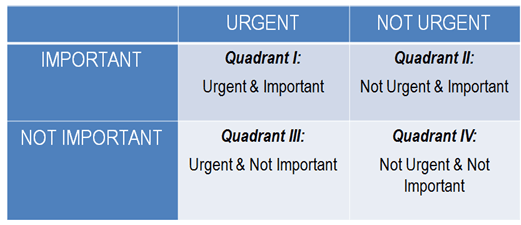

You know that project you've been wanting to do or that goal you've been wanting to accomplish but just haven't? We've all got them. It's probably something you're very interested in or would benefit you a lot, but you can just never seem to make time for it. Maybe you want to learn a new programming language (I'm going to learn Go, I swear), or maybe you're not working out as much as you want to, or maybe you can't seem to finally ship that book or video course. You spend a lot of time daydreaming about these and all the benefits they'll bring, but you're either stuck at square one or they keep getting moved to the back burner.

There's a good chance that these goals or projects fall into the infamous "Quadrant II" from Stephen Covey's The Seven Habits of Highly Effective People: "Important but not Urgent." If you've never seen this grid, it looks like this:

([Image Source](http://www.planetofsuccess.com/blog/2015/stephen-coveys-time-management-matrix-explained/))

Urgent things tend to get done, whether they're important or not (Quadrants I and III). They usually have pressing deadlines with well-defined tasks. Quadrant IV is "Not urgent, not important" and looks different for everyone, but is generally anything that you end up doing to fill the time that you don't want to (like doomscrolling). I used to think Quadrant IV was "anything fun," but I've learned just how important fun is to a balanced life.

Quadrant II is where most of our big wins like financial planning, career advancement, and personal fulfillment live. Unfortunately, these are also the most difficult to accomplish. These projects take a lot of energy since we're building new skills or forging new parts of ourselves with long term results that aren't immediately gratifying.

I've learned a process for getting unstuck on these projects that I want to share with you this week. It only takes about 10 minutes to do but can have a huge impact on your life. It's taken me many years and a lot of reading to hammer this process out, so I'm really excited to share it with you and see if it helps you.

To do this, pick one of your goals or projects and follow along. I'm going to use the example of writing an ebook since I've used this process twice for that purpose.

### Step 1: List all the reasons you're not making progress.

Often when we're stuck on something, we have a series of reasons why we believe we're not making progress. Some of them are valid, but some of them are incorrect, either because they're out of date, based on bad data, or because we're stuck thinking inside the box.

Open up your favorite note-taking app or grab a piece of paper and list all of the reasons why you're not making progress on your goal. Don't worry about whether you're right or wrong. You're the only person who's going to read this, so be honest with yourself and don't judge yourself for anything you write down.

Here's an example list for putting off writing an ebook:

- I don't have the right software
- I don't have time before work
- I don't have energy after work
- I'm afraid I have nothing to say
- What if no one reads it?
- What if someone reads it, thinks it's horrible, and tells the entire internet what a phony I am?

Notice how the list gets a lot more real the longer you think?

### Step 2: Evaluate

Now that you've got your list, it's time to evaluate just how true these statements are. Some of them are subjective, so I like to ask myself questions like:

- How realistic or likely is this?
- What would I tell my best friend if they came to me with this same concern?
- Do I have data that supports this feeling?

That last one is key, especially for all of those fears and "what if"s. Let's look at our list and evaluate:

- I don't have the right software: True, but not a difficult fix with some research.
- I don't have time before work: Maybe true, but maybe not, more data needed.
- I don't have energy after work: True, will require some thought.
- I'm afraid I have nothing to say: Valid fear, but I won't know until I try.
- What if no one reads it?: I can't predict that, but I can take (or have taken) some steps to test out my content before I write a book.
- What if someone reads it, thinks it's horrible, and tells the entire internet what a phony I am?: Very unlikely, especially if I position myself as a fellow learner trying to be helpful to people coming after me.

### Step 3: Separate "Now" from "Later."

Once I've got a better grip on the veracity of my reasons why I'm not making progress, I like to separate out things that I can make an impact on now from things I can figure out later. There's a subtle trick here that I think makes this very powerful: you're not necessarily dismissing the concern or saying it's not a problem, you're just deferring the problem-solving until later because you don't have enough data or it's big and scary. The purpose of this exercise is to figure out where you _can_ start making some headway, not solve every outstanding problem. I'd separate this list out like this:

Figure out now:

- I don't have the right software
- I don't have time before work
- I don't have energy after work

Figure out later:

- I'm afraid I have nothing to say
- What if no one reads it? [Note: if you're thinking of writing a book and have done zero blogging or building an audience in any way whatsoever, it would be worth moving this to the Now column. I can write more about this sometime if anyone is interested.]
- What if someone reads it, thinks it's horrible, and tells the entire internet what a phony I am?

Set aside or cross out the "Figure out later section" and just look at "Figure out now."

### Step 4: Determine the next action.

Once you've got a short list of things that are in your control, it's time to determine the next action. You want this to be **specific** and **measurable**. Avoid saying phrases like "figure out" or "think about." If you need more time to think about something, schedule time with yourself. For example, our list really breaks into two fundamental problems:

- I don't have the right software
- I don't have time or energy in my day

The software problem is straightforward. The next outcome we want is "Find writing software," but that's neither specific nor measurable. Instead, try something like "Spend 30 minutes tomorrow researching writing software" or "Try 3 different writing programs this week."

The problem of having too little time or energy is a little trickier. Let me give you some creative fuel for that.

### Step 5: Challenge your assumptions.

When you run into a barrier that is both immediate and difficult, like the objection of not having enough time or energy to work on a project, it helps to shift your perspective by looking at the problem a different way. As usual, I like to ask myself questions. The first one is, "What am I assuming to be true here?"

With the problem of not having enough time or energy, I might be assuming things like:

- I have to spend 2 hours a day on this.
- I have to do a bunch of admin work to make this happen.
- It's going to take me forever to learn all of the steps of self-publishing.
- I can only work between 6 pm and 10 pm (or whatever it may be for you).

Sometimes we're waiting on someone's approval or permission that we don't actually need, or we're assuming we need to take extra steps than we do, or we've imposed limits or constraints that aren't there. To break through these, we need to ask ourselves questions that get us to think outside of our normal routine:

- **What if the opposite happens?** What if I only work on this a few minutes a day?
- **How can I impose a deadline on this?** What if I publicly commit to having X amount done by Y date? What if I have a presale that essentially guarantees I have to be finished?
- **How can I get other people involved?** What if I hire someone to edit the book or a project manager to check in once a week with me?
- **Are there other ways to get the results I want without the same amount of work?** What if I write this book publicly as blog articles over a few months and then revise or repackage it later to sell? This would separate the writing process from the publishing and selling process.

Most of these big Quadrant II projects happen in isolation with nebulous time constraints, so by judiciously imposing some deadlines and accountability, we can motivate ourselves to take action.

I went through this "no time or energy" problem when I made my ngUpgrade course a few years ago. I wasn't yet working remote, so I would look at my outline of 200 videos and think, "There is no way I will have the energy to work on this when I get home at 5:30!" I realized I was making one big assumption: that I had to be at my job from 9-5. I had a talk with my boss and was able to shift my working hours from 6:30-3:30, which gave me much more time in the evening to work on the course. Changing your working hours might not be an option, but sometimes we just need to reconsider all of our base assumptions until something sticks.

### Repeat as needed.

There's a good chance you won't figure out every detail of your project in your first 10 minute practice of this process. That's okay; you can always repeat it another day. Most importantly, you've gotten your brain to start thinking about how to solve these problems. It's going to do what it does best: work in the background for you and spot opportunities that come up. Pay attention to these moments and listen to them. You'll be goofing off one day mindlessly scrolling through TikTok and all of a sudden your brain will say, "Hey, maybe we should take 5 minutes to look at that writing app." Magic!

Remember what I said in the last article: [embrace your 1% days](/embrace-1-percent-days). You don't always need to make huge amounts of progress on these big projects. Any amount of work towards a goal is forward motion.

Once you've gotten a handle on what you need to do next, you might find my article [How to Finish What You Start](https://www.samjulien.com/how-to-finish-what-you-start) or my book [Guide to Tiny Experiments](https://learn.samjulien.com/guide-to-tiny-experiments) helpful.

As always, give this process a try and let me know if it helps!
