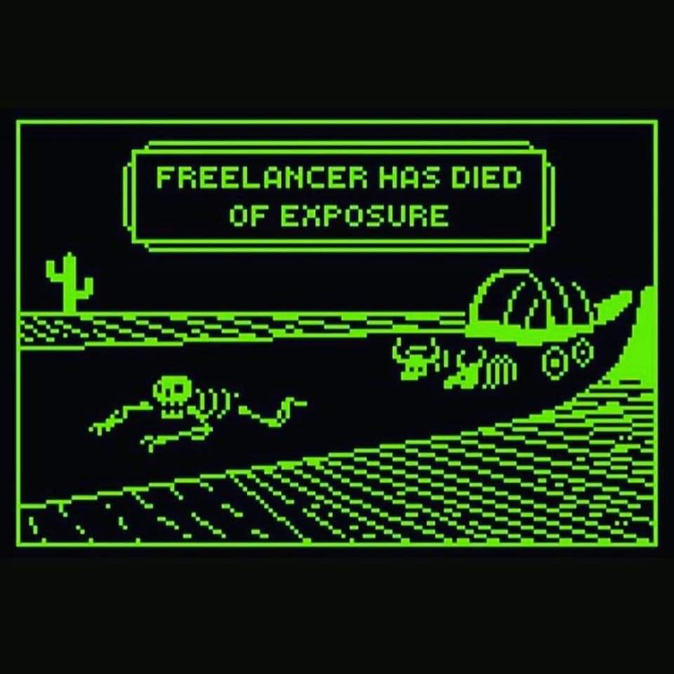

When I was first getting started with content and consulting, I had several friends tell me "you should charge for that" or "you should charge more for that." I didn't value myself or my knowledge and was ready to ride the "it's great exposure!" train at my peril.

(Image credit: [Michelle Nickolaisen](https://michellenickolaisen.com/))

Today I'm going to be that guy for you.

It can be really easy to get taken advantage of when you're creating content to build your career or become a developer advocate, so I want to equip you to get paid what you're worth and know when to create content for free. Then, I'm going to walk you through some examples of how to charge for your content with word-for-word responses.

## When to Charge for Content and Ideas

Before we look at some examples, there are a few factors that I use to determine whether I should charge for something:

1. **Is this for a community project or a for-profit company?** I try to be as generous as time allows for community projects but charge ruthlessly for big companies. Why? For a company, my expertise or content will be used to make them or save them a lot more money than they will pay me. If I consult on ngUpgrade, I'm distilling years of experience into a day or two that will save them at least tens of thousands of dollars.
2. **Will I retain ownership of the content?** This may not seem important at first, but consider: what happens when that company gets sold? Where does the content go? What if the company gets sold to a startup called Rainforest Destroyer and now your name is slapped all over the blog?
3. **Will the content or the discussion be freely available for the community?** If the recordings are behind a paywall or the discussion needs to be private, that probably means I should charge for it. Of course, this is different when you're doing talks or interviews as a developer advocate, since your company is paying you anyway. But if you want to "pick my brain" on a business idea or your company's architecture, you either need to pay me or allow me to record the conversation and publish it whenever and wherever I want.
4. **Will I have full creative control over the content?** If not, that's a sponsorship.
5. **How custom is the proposed solution?** Can I re-use or re-purpose this? Is it specifically adapted to a particular set of problems?

Remember: whether you're consulting for a few hours or writing a blog post, you're not just charging for the time spent. You have to take into account the time and experience you've built up over time. It's the same reason you'd pay David Chang more than your neighbor Jane for cooking lessons. Only one of them created Momofuku. (I mean, I don't know Jane, maybe she's a badass. You do you Jane.)

## Examples of When to Charge

Let's look at some examples. Note that these will be using US dollars and assuming that the company or person is also in the US. You'll need to adjust accordingly for your country/currency/cultural norms.

### Will you write an article for the Company X blog? It's great exposure!

Exposure doesn't pay the bills. Inbound traffic to blogs is a huge source of revenue for software companies. The exposure you get from a popular blog is awesome, but given that you will not own the content, you need to get paid. I've seen articles range from $200-$1000 depending on the company. By the way, most well-known tech blogs out there pay their authors these days, so you should not feel weird at all asking about this.

This same philosophy also works with creating videos for Company X's TikTok or YouTube, though the rates you can charge for video are much higher.

### Will you make a video about Product X? You can put it on your personal YouTube channel!

This is just a different type of sponsorship. Notice that while you retain ownership of the content (since it's on your channel), you are giving up some creative control. That requires payment. Ask them for at least $500 just to get it done, but if you've got subscribers in the thousands, tens of thousands, or more, ratchet that up to $1-5k.

### Can you privately teach me X/give me advice on Y? I am trying to create a product/service.

If this is a person I know or an idea I find interesting and have time for, my default is to ask the person if I can record the session and publish it for others to benefit from. If they don't want to do this, I charge for an hour or two of consulting. Obviously this is at your discretion, so if your buddy needs help and you want to give it, go for it. Most of the time for me, my time has to either benefit the community at large or be private consulting. Sometimes it _feels_ like the generous thing to do is give someone private time for free, but things can get weird fast if they end up using your expertise to make a boat load of money. I'd rather just keep it simple.

Side note: you know those bonus interviews you see in a lot of tech video courses? Most of those follow this principle. The creator pays the person for an hour or two of consulting in the form of the interview, which then can be packaged into the course. This keeps things clean instead of worrying about percentages of sales.

Of course there are exceptions to all of these examples. Do whatever you want to do, but make an informed decision that feels worth the trade. I've done content deals that ended up not being a very good return on my time but taught me valuable lessons or built long-term relationships. That's fine.

Overall, remember: your time, reputation, and expertise are valuable. Don't be afraid to say no if something isn't worth it for you. There is no shortage of people who want you to make content for them. In thinking about whether to say no and how much to charge, don't forget to factor in the time you won't be able to spend on other things while working on this project. They're not just paying for the deliverable, they're paying for your time and attention.

I made this mistake with a commissioned course once. I drastically underestimated the amount of time it would take, which caused me to say no to a bunch of other opportunities that would have been a better investment. I should have either charged way more or just said no, but I was already committed. I'll know for next time!

Now that we've looked at when to charge for content, let's learn exactly how to do it.

## How to Charge for Content

Full disclosure: I used to be completely and utterly terrified to ask for money for my creative work. I was embarrassed about asking for a specific dollar amount and worried that it made me look cold or mercenary. I hadn't yet learned how to distinguish between my community work and my paid work for big companies. That came across in my emails much more than I realized and made me miss out on a lot of opportunities.

I've had friends and mentors teach me this money stuff over the last several years and it's worked very well, so I want to pass on whatever I can to you. I wasn't born knowing this stuff by any stretch of the imagination; it's a set of skills to learn and practice.

Also, please note that these examples and this negotiation style are based on US culture and companies simply because that's what I know. That said, I know a lot of you around the world are often interacting with US based companies, so I'm hoping you'll still find this useful.

Let's say you've just received this email:

> Hi there, 
> We saw your work in X and would love for you to create a video [or write a blog post, give a talk, etc] for our company. Let me know if you're interested and we'll set up a time to talk about topics. 
> Thanks, 
> So-and-so 
> Big Company Y

There are a few different ways you could approach this; I'll share two of them with you in this email. Your response to this depends on two things:

- Whether time or money is more valuable to you right now
- How favorable you are to Big Company Y (Do you like them? Do they have a good reputation in the community?)

In any case, be direct, be confident, and be kind.

### Option 1: Your time is more valuable than money.

Here's how you could respond if _time_ was more valuable to you and you'd like to optimize for a "no" unless they're willing to pay you a high rate:

> Hi So-and-So, 
> Thanks so much for thinking of me! I do have a small amount of availability right now. My rate for this kind of work is $2000. If that fits in your budget, let's set up a call. I'm available next Tuesday at 10 am or 12 pm. 
> Cheers, 
> You

Notice a few things here:

- The tone is friendly and positive while also confident. You don't need to be a jerk when negotiating (it often works against you). Thank them, keep it light, but be direct in what you're looking for.
- Give them a specific number instead of asking if this is a paid gig or how much it pays. In doing this, _you let them know you're not interested in working for free._ If you're trying to be picky about the work you do, aim high. Give a rate that is at least 30-50% more than you might think, not because you're greedy, but because it's very easy to underestimate the scope and time requirements for these kinds of projects.
- Notice that "Is that alright with you?" or "Will that work?" are missing. Tell them what works for you; it's up to them to say yes, no, or make a counter-offer.
- Move the conversation forward by offering times to meet. This eliminates a lot of back and forth.

There are a couple of different possibilities for how the person at Company Y will respond:

1. If they're serious about pursuing you but have a set budget, they'll tell you: "Our rate for these videos is $1000. Will that work?"
2. If they don't have a number in mind, they're looking to you as the expert to set the price. There's a surprisingly high chance they'll just say, "Sounds good!" Big companies have deeper pockets than you might realize.
3. If they're not that serious or have drastically under-budgeted, they'll just say, "That's outside of our budget. Thanks anyway!" That's okay. Don't chase them down to counter-offer. I know that's scary to miss out on work, but remember, in this example, we want to eliminate unnecessary work that's not worth it. We'll cover a different example in a bit.

In case #1, the ball's in your court to accept, reject, or counter. To reject, you could say something like:

> Unfortunately I'm not able to reduce my rate to that amount right now. Thank you again for thinking of me, though!

To counter, you could say:

> Unfortunately I'm not able to reduce my rate below $1500 [or whatever you decide]. Let me know if you're able to adjust. Thanks!

Side note here: if they come back with less than half of what you asked, either you're too far above the market rate or they're too far below it. Unfortunately the best way to determine this is through experience, so always go with your gut. Don't think of it in terms of the going rate; think of it in terms of trading your time for money.

### Option 2: Money is more valuable than time.

Now, you might be thinking, "Good grief Sam, I'm just looking to start getting paid for writing and making videos. I'm not over here trying to chase everyone away with those numbers!" This means that, for you right now, _money is more valuable than time._ This is totally fine. Let me give you some magic words to help you with this.

For the initial response, instead of coming right out with a high rate, you could say this instead to signal that you're interested in working with them:

> Hey So-and-So,
> Thanks so much for thinking of me. I have some availability; what is your budget for this project?

I don't know why, but "what's your budget" seems to always work better than "what does this pay." It assumes that the content is paid (which, again, tells them you don't work for free) and it shifts the burden on them to come up with a number. Notice also that I didn't say yes right out of the gate before knowing what they're going to pay.

They'll again respond with one of the answers above. There's a good chance they will tell you the lowest possible budget number instead of the highest, so it's up to you to decide whether to accept it or ask for more.

One more thing: if they quibble over a small amount of money ("we can do $900 but not $1000"), there's a decent possibility they won't be good to work with. Why? Either they've got too much bureaucracy in their organization which is going to bleed into your creative process (which is really annoying) or they're too strapped for cash and will fight you on anything that makes them worry you're going to ask for more money, like an increase in scope of the project. Obviously I'm generalizing here and you should use your own instincts, but in my experience with consulting or doing paid content, the best clients are nearly always the lowest maintenance. They've got the means to respect your time and the perspective that you're the expert. I should also mention here that a notable exception is an established program where they pay a fixed amount 100% of the time to all authors.

## Getting Paid for Content

Whenever you settle on a number, at some point they will most likely ask for you an invoice and some sort of tax record. In the US this is a W9 form. They may also ask you to sign a contract that specifies that they will own the resulting content. You can use Google Docs, PayPal, or a tool like [FreshBooks](https://www.freshbooks.com/) to create the invoice. Don't stress over whether you have the proper legal business structure at first, but if you do end up doing this a lot, you might want to look into that with an accountant or an attorney.

So when do you get paid? A very common payment timeline is called "net 30," which just means 30 days after the invoice. Usually this happens after you deliver the content, but sometimes it's up for negotiation. If you do anything longer term than a single piece of content, like a course, ask for some portion up front. I've asked for half up front and half on delivery, as well as 25% chunks at different milestones, but I've had other people advise me to ask for 100% up front.

## Practice, Practice, Practice

If you're feeling stressed or nervous about these conversations, that's normal. This will get easier as you get some practice and start seeing what works and what doesn't. As you start to get some of these under your belt, you'll start to see the correlation between the time and money. The thought of getting paid thousands of dollars to make a course or a video might seem completely audacious at first, but as you start logging hours and hours of work and going back and forth on Slack over the content with the company, you'll start to see it as just another source of income that needs to be worthwhile for you.

Finally, don't be afraid to make mistakes. You will likely undercharge a few times or miss out on some work because you aimed too high or didn't word things right. That's okay. It's not a failure, it's a test. Just keep learning and experimenting.

I hope this was helpful for you. Try this stuff out for yourself and let me know how it goes. And go get paid for all that hard work you're doing!

_This article started its life as two issues of my newsletter **Developer Microskills**. If you found it helpful, sign up below to receive a practical, actionable way to improve as a developer and developer advocate every week._
