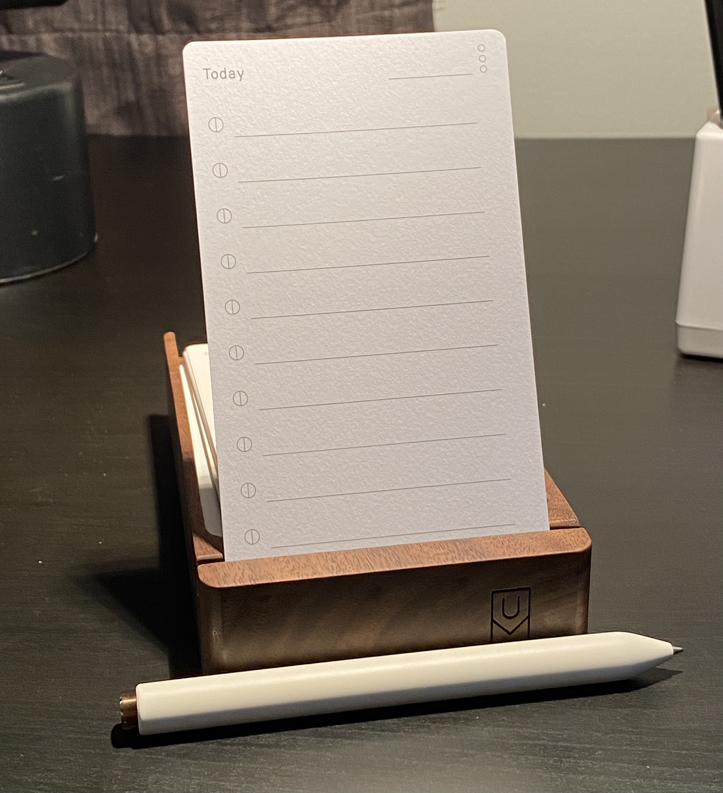

I have a confession. My focus has been extremely fragmented since moving to management at the beginning of this year. As a developer and then developer advocate, most of my work was creative. I would put on some headphones, get in the zone, and write code or create content for hours. When I became a manager, a lot of my work became administrative: meetings, tasks, delegation, etc.

I've done fine with it, but I've hit a fork in the road. This new interim director role is not really about those administrative tasks. In fact, the bulk of this job as I see it is to think deeply, make wise, complex decisions (with a lot of input from other people and data sources), and share the results of that thinking and deciding through reports, coaching, and messages. In short: thinking, writing, and communicating. I've been struggling lately because I feel like my schedule is so packed with meetings and busywork that I haven't had nearly enough time to put deep thought into the big projects that will really take our team to the next level.

I recently started reading _Deep Work_ by Cal Newport and it captures this dilemma perfectly. Here's Cal's definition of deep work:

_Deep Work: Professional activities performed in a state of distraction-free concentration that push your cognitive capabilities to their limit. These efforts create new value, improve your skill, and are hard to replicate._

The opposite of deep work is shallow work:

_Shallow Work: Noncognitively demanding, logistical-style tasks, often performed while distracted. These efforts tend to not create much new value in the world and are easy to replicate._

Newport posits that, "the ability to perform deep work is becoming increasingly rare at exactly the same time it is becoming increasingly valuable in our economy." As a result, "the few who cultivate this skill, and then make it the core of their working life, will thrive."

For about the last two weeks, I've been experimenting with a return to pen and paper for my thinking, planning, and task management. It's been pretty fantastic, I've got to be honest. At the beginning of August, I had to travel to our Bellevue office to work on a bunch of important projects. I was feeling very overwhelmed and it was hard to keep track of everything. In the airport on the way home, I bought a simple journal and a cheap ballpoint pen and started to write a bunch of things down. I had a lightbulb moment scribbling on that airplane. I used to journal a ton when I was in high school and college and I completely forgot how much faster I can process information when I'm able to draw maps, annotate, and physically write tasks out. One hour of writing is much more efficient than one hour of "digital thinking" for me.

### What's Working

In just a couple weeks of using pen and paper, I've already noticed many benefits.

First, it **breaks the app hamster wheel**. You know what I'm talking about: do a little work for a few minutes, then check Slack, check messages, check email, check Twitter, repeat. I'm finding that even just spending a few minutes after a meeting writing things down and thinking through the next couple of hours gives me back a lot of focus. I've also designated a section of my workspace away from my monitor for writing, so I can totally break away from my screen to think and process.

I also have **much better recall** for what I've physically written down than what I've typed. Writing adds "useful friction" to my thinking in the same way that writing code cements learning much better than just copying and pasting. It's also much easier to review yesterday's notes and figure out where I'm at and what I need to do each day since it's right there in front of me.

Finally, journaling **keeps me off my phone** in the evenings. Usually while I'm watching TV to wind down at night, I have a bad habit of checking my phone and doing the app hamster wheel dance between Twitter, email, and Discord. It's not that spending time in these apps is inherently bad or that I need to make every minute of every day productive, I just want to be intentional about how I spend my time. Apps like Reddit, TikTok, and Twitter are like those infinity pools where you can swim endlessly. I hate the feeling of picking up my phone and then realizing an hour has gone by. Holding a pen in my hand and just jotting things down as I feel like it is a great way to keep me from unconsciously spending a huge amount of time on my phone.

### What I'm Doing

I'm primarily using pen and paper for four things:

1. Morning planning for the day, where I review my calendar, think through what's important for the day, and write down any vital tasks to do or delegate.
2. Jotting down notes, ideas, or tasks throughout the day, especially after meetings. I also write down requests I get in Slack, email, Discord, or Twitter so I don't want to be distracted from what I'm working on.
3. Evening reflection and planning for tomorrow (basically "morning planning in reverse")
4. Weekly planning (basically "extended morning planning")

I'm also working my way through _The Bullet Journal Method_ by Ryder Carroll and slowly adopting some of the Bullet Journal way. I'll never have Instagram-worthy journal art or anything, but I'm liking it so far.

If you're curious, I'm now using a [Mark One](https://www.studioneat.com/products/markone) rollerball pen after a friend recommended it. I'm digging it. I've never really paid any attention to pens at all, so I'm really curious to learn about why some people love pens so much.

I've also just received the [Ugmonk Analog system](https://ugmonk.com/pages/analog). This is a card-based productivity system and it's pretty interesting:

The idea is that, every day, you write down only the most important things to accomplish and keep it right in front of you. It's a really nice, well-made artifact. My only concern is that it almost feels a little _too nice_, like I'm going to feel guilty every time I toss one of those perfect little index cards into the recycling bin. Part of me also kind of loves it though because it's so well-made, so I'm at least going to use what I've already bought and revisit.

### Being Okay with Impermanence

Aside from the need to get back to deep work, one of the main catalysts for my return to pen and paper was the realization that I _almost never_ come back to brainstorming notes or completed task lists. I've never thought to myself, "Gee, I wonder what tasks I completed on March 20, 2020." I regularly write and review project notes in Obsidian, but other than that, most of my work consists of deliverables: articles, newsletter issues, reports, videos, emails, and messages (maybe someday code will be in there again, sigh). I don't especially need to care about the tiny intermittent steps of getting those done once they're shipped. When I review what I've done each quarter, I have a long trail of artifacts that can tell me how I spent my time.

I realized that I was digitally capturing nearly every thought, idea, or piece of text that I was creating into either OmniFocus, Notion, Obsidian, and Drafts. My signal to noise ratio was too high. I had too many things to keep track of and too many inboxes to clear out. Ironically, because I had over-optimized this capture step, it became incredibly difficult to clarify, organize, or review any of this data. There was just too much to sort through and it became difficult to retrieve it when I needed it. Where did I write that thing down? Is it in Drafts? Did I already add a task to OmniFocus? Or was it in my Notion backlog? What should I move to Obsidian? Journaling is hitting that sweet spot for me of easy to capture but also easy to review.

### Questions to Consider

I hope you've found this window into my thought process useful. Here are a few questions to ponder:

- Where might you need "useful friction" in your life or work?
- Are you over-complicating any systems?
- What's the nature of your work? What's "deep work" look like for you?

As always, I'd love to hear your thoughts and if you found this helpful.
