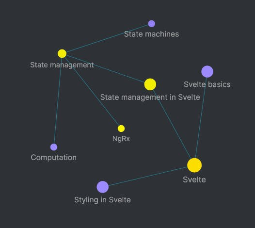

You may have experienced a similar level of anxiety as me when it comes to the following:

- Writing a quarterly report for work (Where are all the links I need?)
- Creating a long blog post or substantial video (What were those concepts I learned? How did it feel to learn them? What did I think was important at the time?)
- Filling out your performance review to prepare to ask for a raise (What projects did I work on this cycle? Did they go well?)
- Spinning out with overwhelm and not knowing what to do next (What did I do last time? Did it work?)

What if you had your own custom version of Microsoft's Clippy that showed up at the exact right time with the exact information you needed? It would say things like:

- "I see you're writing a performance review, would you like to look at last year's projects?"
- "I see you're creating a video about Apollo, would you like to see your notes from when you were learning it?"
- "I see you're having a rough day. Here are some things that have helped you with that in the past."

You can create your own Clippy by building your own **Personal Knowledge Management (PKM) system**. A PKM system can help you:

- Retain information
- Create deeper content faster
- Develop, visualize, and surface ideas
- Write your own owner's manual, an atlas for your brain
- Be your own best friend by giving you steps to take when you're stuck in your head

But what is PKM and why is it so valuable?

## Visualization: The Magic of Personal Knowledge Management

In my newsletter-turned-article _Get Started with Obsidian as a Developer_, I went over the basics of Personal Knowledge Management. I'll link to it towards the end so you can check it out, but essentially, PKM is a way to create a digital filing system for you to create, develop, and link ideas.

PKM apps like Obsidian and Roam Research let us codify mental connections using backlinks, bidirectional links between notes. In most of these apps, this is done with two square brackets: [[this is a backlink]].

If you were learning about the web framework Svelte, you could you create backlinks between notes on styling, state management, and routing in Svelte. You could also link your notes about state management in Svelte to notes about state management in Angular or React, state machines, or even just general computation notes.

The real magic, though, lies in the ability to visualize those connections through graphs. Here's how that Svelte example would look as a graph in Obsidian:

This visualization tool is extremely powerful as it sparks more connections, cements your understanding, and inspires content creation. Harnessing this power can honestly be life-changing, as bold of a claim as that sounds. Not only has my PKM system saved me a lot of time, it's also enabling me to perform at a higher level and create deeper connections between ideas.

## What I Wish I'd Known Starting with PKM

Now that you have a high level view of why I believe knowledge management is the most valuable non-technical skill of 2021 (I mean, behind things like decency and compassion of course), you're ready to get started.

Before you do, let me share with you a few things I wish I had known. Diving head first into a tool like Roam or Obsidian can be extremely overwhelming. At first, I tried to dump all of my notes from Drafts, Google Docs, Google Keep, and Bear into Obsidian and hope for the best. I didn't recognize the difference between _note-taking_ (jotting down things as you listen or watch or highlighting as you read) and _note-making_ (creating valuable, evergreen reference material for yourself).

Here are a few more tips:

- The goal with PKM isn't to become a digital librarian hoarding articles into a massive digital archive. Don't treat Obsidian like you'd treat Pocket or Instapaper. The goal with PKM is more akin to self-documentation, building a conversation partner that you can think through problems with and that helps you remember things.
- The most useful notes you can make are opinions you hold. When I started building my PKM system, I only created notes that were nouns or facts. These ranged from coding concepts ("React Hooks") to tools ("Drafts") to ideas ("Beginner's mind"). While these are foundational to the system, the real power lies in creating notes around what you think: "Perfect is the enemy of done," "The map is not the territory," "React hooks are mostly helpful." This is what makes your system unique and what turns your system into a conversation partner. As these opinion notes pop up on my graph, I find myself naturally having deeper ideas about them.
- Don't worry about forcing structure from the start by creating a bunch of folders. It's really easy to get overwhelmed trying to categorize and create layers of taxonomy for all of your thoughts and ideas. Don't force structure right at first, just let it emerge. I tried to use Tiago Forte's PARA system ("Projects, Areas, Resources, Archive") and just found it too restrictive for the way my brain works. You might have a bunch of notes in a single folder, but the backlinks will make that much less of a problem than you're used to.
- Think of your PKM as your "digital workbench" or "mental dev environment": don't be afraid to break the structure and refactor as you go. There's no pressure to have a finished state. I find working in my PKM system very relaxing. I refactor my thoughts and ideas just like I do with code.
- Don't be afraid to branch out into non-work and non-creative areas. I've really been enjoying documenting workflows, relationships, and tools so that I can keep track of maintaining and improving them. I've even created a self-care "map of content" (basically a fancy PKM term for an index) that links to notes like "When I'm feeling overwhelmed" and gives me a checklist of questions to regularly ask myself.

## Where to Go Next with PKM

Knowledge management can help you write better, stay on top of your projects and relationships, and overall just make you think faster. If I've persuaded you to learn more, here are some action items for this week:

- First, read my article [Get Started with Obsidian as a Developer](https://www.samjulien.com/get-started-with-obsidian-as-a-developer).
- From there, go watch Nick Milo's video [What is PKM?](https://www.youtube.com/watch?v=Q2WBHyqRsxA&list=PL3NaIVgSlAVJKJf37XqEhUduqTBQ2e-sl). Nick is a really incredible teacher of both PKM and Obsidian. He breaks things down so they're easy to understand but also gives very practical guidance on how to get started.
- Install Obsidian and start adding a few notes and backlinks. Watch the graph change as you do.

Write me and let me know how it goes. Also, would you be interested in a workshop on this? Let me know. Good luck!
